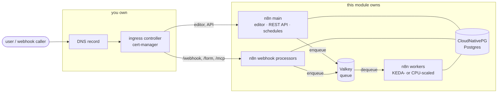

# terraform-kubernetes-n8n

> **⚠️ Community project, not an n8n product.**
>
> This module is written and maintained by [@TpyoKnig](https://github.com/TpyoKnig)
> and published to the Terraform Registry as
> [`TpyoKnig/n8n/kubernetes`](https://registry.terraform.io/modules/TpyoKnig/n8n/kubernetes/latest).
>
> **n8n GmbH does not write, review, endorse, support or take responsibility
> for it.** Holding an n8n licence entitles you to nothing here, and n8n's
> Support team cannot help you with it. Do not send bug reports or security
> findings about this module to n8n: they cannot act on them, and it only
> delays the fix.
>
> n8n's own Terraform module is
> [`n8n-io/n8n/aws`](https://registry.terraform.io/modules/n8n-io/n8n/aws/latest).
> **If you are deploying on AWS, or you want a module n8n stands behind, use
> that one instead.** This one exists because that one builds the cloud
> foundation as well as the workload, and targets an Enterprise licence. If
> you already run a cluster and you are on Community edition, that module has
> nothing to sell you and this one might.

Terraform module that deploys [n8n](https://n8n.io) onto a Kubernetes cluster you already run. One `terraform apply` brings up n8n and everything it needs to work: PostgreSQL, a Redis-compatible queue, the namespace, Secrets and an Ingress. No cloud account anywhere.

It's the Kubernetes sibling of [`terraform-aws-n8n`](https://github.com/n8n-io/terraform-aws-n8n) and keeps that module's shape on purpose (one resource-bearing root, the same variable and output naming, the same quality bar), so if you know that one you can read this one.

**No n8n licence is required or accepted.** Everything it deploys is Community-edition n8n: queue mode, separate worker and webhook-processor pools, HPA and KEDA autoscaling. It renders no licence key, no multi-main topology and no licence-gated environment variables.

## Table of contents

- [What this module does and does not own](#what-this-module-does-and-does-not-own)
- [Prerequisites](#prerequisites)
- [Usage](#usage)
- [Backing services](#backing-services)
- [Ingress, TLS and DNS](#ingress-tls-and-dns)
- [Autoscaling and capacity](#autoscaling-and-capacity)
- [Sizing](#sizing)
- [Examples](#examples)
- [Operations](#operations)
- [Stability and versioning](#stability-and-versioning)
- [Support](#support)
- [Out of scope](#out-of-scope)
- [Reference](#reference)

## What this module does and does not own

The cloud siblings build a cluster *and* the workload on it. This one can't: there's no generic "create a Kubernetes cluster" resource, because the answer is different for Talos, kubeadm, k3s and every managed offering. So the boundary sits somewhere else on purpose.

**The module owns:** the namespace, the Secrets, the n8n Helm release and its values, the CloudNativePG `Cluster` and the Valkey release when you pick them, the `Ingress` when you ask for one, the worker `ScaledObject` when you attest KEDA, the task-runner `ConfigMap`, and two optional `LoadBalancer` Services.

**You own:** the cluster, the ingress controller, cert-manager and its `ClusterIssuer`, the CloudNativePG operator, KEDA, a default `StorageClass`, metrics-server, and DNS.

That second list isn't an oversight. Every one of them is a cluster-wide singleton serving every workload on the cluster, and a module that installed one would be signing up to upgrade and destroy it on behalf of workloads it can't see. I'm not doing that.



Postgres and Valkey are only inside that boundary on the in-cluster defaults. Set either backend to `"external"` and it moves to your side, same as the ingress controller.

## Prerequisites

- A running Kubernetes cluster and a kubeconfig for it. Terraform `>= 1.11`.
- **CloudNativePG operator**, cluster-wide, if you're on `postgres_backend = "cnpg"` (the default):
  ```bash
  helm install cnpg cnpg/cloudnative-pg -n cnpg-system --create-namespace
  ```
- **An ingress controller** and **cert-manager**, if `create_ingress = true`. The `ClusterIssuer` you name in `k8s_ingress_cluster_issuer` has to exist already, or [`modules/tls-letsencrypt`](./modules/tls-letsencrypt/) will make you a Let's Encrypt one.
- **A default `StorageClass`**, or name one yourself with `cnpg_storage_class` / `valkey_storage_class`.
- **metrics-server** (or another `metrics.k8s.io` implementation) for CPU-based autoscaling.
- **KEDA**, only if you want workers scaling on queue depth instead of CPU.
- **A DNS record** pointing your hostname at the ingress. The module creates none; see [Ingress, TLS and DNS](#ingress-tls-and-dns).

The module doesn't verify any of this. A missing operator shows up as a resource sitting unreconciled in the cluster, not as a Terraform error, because applying a custom resource tells you nothing about whether anything picked it up.

## Usage

```hcl
module "n8n" {
  source  = "TpyoKnig/n8n/kubernetes"
  version = "~> 0.2"

  n8n_domain = "n8n.example.com"

  k8s_ingress_class_name     = "nginx"
  k8s_ingress_cluster_issuer = "letsencrypt-prod"
}
```

That's the whole required surface: a hostname and how to serve it. Everything else has a default that works on an ordinary cluster.

**On OpenTofu, use the git source instead.** OpenTofu resolves registry modules against `registry.opentofu.org`, which is a separate index from HashiCorp's `registry.terraform.io`. This module is published to the latter only, so the address above fails with `Module not found`:

```hcl
module "n8n" {
  source = "git::https://github.com/TpyoKnig/terraform-kubernetes-n8n.git?ref=0.2.1"

  n8n_domain = "n8n.example.com"
  # ...
}
```

That resolves the same commit the registry serves. There is no `version` argument on a git source, so the `?ref=` **is** the pin, and a range constraint is not available: see [Stability and versioning](#stability-and-versioning).

Providers are yours to configure. The module declares no `provider` blocks:

```hcl
provider "kubernetes" {
  config_path = "~/.kube/config"
}

provider "helm" {
  kubernetes = {
    config_path = "~/.kube/config"
  }
}

# kubectl applies the CloudNativePG Cluster CR. Unlike the kubernetes provider
# it does not read a kubeconfig implicitly, so load_config_file is explicit.
provider "kubectl" {
  config_path      = "~/.kube/config"
  load_config_file = true
}
```

## Backing services

Postgres and Redis are picked independently, and each has an in-cluster default and a bring-your-own path.

| Input | Default | Values |
| --- | --- | --- |
| `postgres_backend` | `"cnpg"` | `"cnpg"` (in-cluster CloudNativePG `Cluster`), `"external"` (bring your own, via `db_host`) |
| `redis_backend` | `"valkey"` | `"valkey"` (in-cluster `valkey-io/valkey-helm` release), `"external"` (bring your own, via `redis_host`) |

On either `"external"` path the endpoint is yours in full, so the connection
details come from your inputs instead of the in-cluster defaults:
`db_host` / `db_port` / `db_name` / `db_user` / `db_password` for Postgres,
`redis_host` / `redis_port` / `redis_username` / `redis_auth_token` for the
queue. The `cnpg_*` and `valkey_*` inputs configure the in-cluster services and
get ignored when you bring your own. The module creates neither the database
nor the role. Both have to exist already, with `db_user` owning `db_name`, or
n8n's first migration fails on permissions rather than on connectivity.

**Why CloudNativePG rather than a chart.** The conventional in-cluster Postgres was the Bitnami chart, and Bitnami's free Docker Hub catalogue moved to `bitnamilegacy` and stopped getting updates in August 2025. With that gone the choice is an operator or a hand-rolled `StatefulSet`, and Postgres is the piece with the most operational surface (failover, PITR, major-version upgrades), so the operator wins.

**Why Valkey rather than Redis.** Redis Ltd relicensed Redis at 7.4 under RSALv2/SSPLv1 in March 2024. Valkey is the Linux Foundation fork that stayed BSD, speaks the same wire protocol n8n's Bull queue already uses, and is where the packaging ecosystem went.

On the `cnpg` path the operator generates credentials into its own `<cluster>-app` Secret, so there's no password input to supply. On `external`, either supply `db_password` or point `db_password_secret_ref` at a Secret you own. The module references that Secret without ever reading it, so a wrong name shows up as a pod stuck in `CreateContainerConfigError`, not as a Terraform error.

**Backups aren't configured.** CloudNativePG takes none by default and neither do I. Set up `barmanObjectStore` on the cluster, or run a `pg_dump` CronJob. A PVC is not a backup.

## Ingress, TLS and DNS

The module renders an `Ingress` with your ingress class and a cert-manager `ClusterIssuer`, and **creates no DNS record**.

That last part is on purpose. How a name reaches a self-hosted cluster depends completely on the setup: a tunnel, a public LoadBalancer, split-horizon DNS on a LAN, a reverse proxy on a VPS, an overlay network. There's no default that isn't wrong for most people, and picking one would force every caller to hold credentials for a provider they might not use. [`examples/homelab-cloudflare`](./examples/homelab-cloudflare/) works one strategy end to end.

**Multiple hostnames.** `n8n_additional_domains` adds host rules to the same `Ingress`, lower-cased and de-duplicated. `n8n_domain` stays canonical, it's what n8n advertises unless `n8n_webhook_url` overrides it.

**Webhook routing.** This is the easy part to get wrong. Production webhooks are disabled on the main pods, so five path prefixes have to reach the webhook processors instead: `/webhook`, `/webhook-waiting` (which also carries the Slack and Telegram human-in-the-loop callbacks), `/form`, `/form-waiting`, and `/mcp`. The chart renders a second `Ingress` covering the first four, and the module adds a third for whatever the chart leaves unrouted, which today is just `/mcp`. Adding a host to the main list routes it on all of them. If a future chart version starts rendering `/mcp`, the third `Ingress` disappears on its own.

**TLS.** The module names the `ClusterIssuer` and never looks at the certificate that comes out, issuance is cert-manager's job. If you don't have an issuer yet, [`modules/tls-letsencrypt`](./modules/tls-letsencrypt/) creates a Let's Encrypt one solving HTTP-01 through your ingress controller. Pass its `cluster_issuer_name` output straight into `k8s_ingress_cluster_issuer` so the annotation and the issuer can't drift apart. It's a separate submodule because a `ClusterIssuer` is cluster-scoped and shared, and two deployments must not both own it.

**Caller-owned routing.** Set `create_ingress = false` and build your own. The outputs you need are `namespace`, `n8n_service_name`, `n8n_webhook_service_name`, `n8n_service_port` and `n8n_webhook_path_prefixes`. That last one exists so your `Ingress` can't drift from what the module expects. [`examples/homelab-split-ingress`](./examples/homelab-split-ingress/) builds it.

**Splitting the editor from webhooks needs no licence.** Queue mode and separate webhook processors are Community-edition features, and a split ingress is just two hostnames pointed at pools that already exist.

## Autoscaling and capacity

Workers scale on **queue depth** when you attest KEDA is installed (`k8s_keda_installed = true`), and on **CPU** otherwise. CPU is a lagging proxy here: a worker blocked on a slow HTTP call sits idle while its queue grows.

It's an attestation rather than a lookup because a refresh-time data source would make the whole scaling branch unknown at plan time. It defaults to `false` because a `ScaledObject` with no operator behind it never reconciles, and nothing fails, the workers just sit at their floor forever.

**Capacity diagnostic.** The module reads the cluster's allocatable CPU and warns at plan time if the autoscaler ceilings, all maxed at once, add up to more than it can hold. Cordoned nodes and nodes with a `NoSchedule` or `NoExecute` taint are excluded (`PreferNoSchedule` still counts), so dedicated control planes don't count as usable. The warning never fails a plan.

Set `k8s_capacity_check_enabled = false` if the cluster isn't reachable at plan time or the credentials can't list nodes cluster-wide. That removes the node read itself, not just the warning.

## Sizing

| | Main | Workers | Webhook | CNPG |
| --- | --- | --- | --- | --- |
| Small / lab | 1 | 1-3 | 1-2 | 1 instance |
| Medium | 1 | 3-10 | 2-4 | 3 instances |
| Large | 1 | 10-40 | 4-10 | 3 instances |

The main pod stays at one replica at every size. It serves the editor and the
REST API and owns the schedule triggers, the load that actually grows is
executions, and that's carried by the worker and webhook pools. A second main
would need leader election, which n8n gates behind a licence.

## Examples

| Example | What it shows |
| --- | --- |
| [`homelab`](./examples/homelab/) | The base deployment. Every substitutable layer named with its default, the reason for it, and the input that swaps it. Start here. |
| [`homelab-pgbouncer`](./examples/homelab-pgbouncer/) | The base deployment with a PgBouncer connection pooler in front of PostgreSQL, plus measured throughput and sizing guidance. Reach for it when the worker tier autoscales: pod count times pool size hits `max_connections` before anything hits a CPU limit, and pods CrashLoop rather than slowing down. |
| [`homelab-cloudflare`](./examples/homelab-cloudflare/) | The base example plus one worked DNS strategy: a proxied CNAME to a Cloudflare Tunnel. Differs from `homelab` only in its DNS resources. |
| [`homelab-godaddy`](./examples/homelab-godaddy/) | The same, for a GoDaddy zone: a plain A record to a routable ingress address. Use when your ingress is publicly reachable; use the Cloudflare one when it is not. |
| [`homelab-split-ingress`](./examples/homelab-split-ingress/) | Editor and production webhooks on separate hostnames, with caller-owned `Ingress` objects, so an identity-aware proxy can front the editor without breaking webhook delivery. |
| [`homelab-cloudflare-split-ingress`](./examples/homelab-cloudflare-split-ingress/) | The split topology behind a Cloudflare Tunnel: a proxied DNS record per hostname, the proxy-hop count the tunnel adds, and a `ReadWriteMany` volume shared across the main, worker and webhook-processor pods so binary data survives the split. |

No sizing-tier examples on purpose. On this platform the tiers differ by a handful of values the table above already gives you.

## Operations

- [Operations guide](./docs/operations.md): prerequisites, sizing, backups, day-two operations.
- [Troubleshooting](./docs/troubleshooting.md)
- [Upgrading n8n](./docs/upgrading-n8n.md)
- [Post-deployment](./docs/post-deployment.md)
- [AI Assistant and Agents](./docs/ai-assistant.md): wiring the assistant, its web search and its code sandbox.
- [Module contract](./docs/module-contract.md): the conventions a PR is measured against.
- [Helm chart coverage](./docs/helm-chart-coverage.md): which chart values this module exposes, and what is pinned.

**Back up `n8n_encryption_key` before you need it.** Losing it makes every stored credential permanently unreadable, and that survives a database restore: put Postgres back without the original key and the credentials are still there and still undecryptable. Get it with `terraform output -raw n8n_encryption_key`. If you set `n8n_encryption_key_secret_ref` the output is null, because the module never reads the key, so take it from the Secret you own.

## Stability and versioning

`0.2.1` is the current release: the PgBouncer pooler for the CNPG backend, binary data onto a shared volume, and the #23–#32 wiring-audit fixes for inputs that were silently discarded before reaching the chart. Upgrading rolls pods where the fixed values change the rendered chart: the executions settings start applying (see the changelog for per-input compatibility values), and — from `0.1.0` — any deployment with task runners enabled rolls main, worker and webhook-processor, because the idle-shutdown fix moved a value out of `config.extraEnv` that every n8n container carried. Older tags stay where they are and keep working as exact pins.

Still pre-1.0, so a minor bump may break the input surface. `~> 0.2` is the constraint the usage example uses; it takes patches and holds the minor. `1.0.0` is a promise to make once the variables stop moving, not a milestone to hit on a date.

Straight from git works too, and is **required on OpenTofu**, which resolves registry modules against a different index that this module is not published to: `source = "git::https://github.com/TpyoKnig/terraform-kubernetes-n8n.git?ref=0.2.1"`. See [Usage](#usage). Whichever source you use, tracking the default branch instead of a tag means an apply can pick up a breaking change you didn't choose.

## Support

**This is a community project. It isn't an n8n product, and n8n doesn't offer, endorse or support it.** n8n's Support team covers n8n's commercial offerings and this isn't one of them, so holding an n8n licence entitles you to nothing here.

Bugs and feature requests: open a [GitHub issue](https://github.com/TpyoKnig/terraform-kubernetes-n8n/issues). Best effort, no SLA.

## Out of scope

This module does not:

- **Create the cluster.** "Create a Kubernetes cluster" isn't a resource any provider offers generically, the answer is different for Talos, kubeadm, k3s and every managed offering. Bring your own, see [Prerequisites](#prerequisites).
- **Install cluster-wide operators.** cert-manager, CloudNativePG, KEDA, an ingress controller, a `StorageClass` and metrics-server are singletons shared by every workload on the cluster. A module that installed one would own upgrading and destroying it on behalf of workloads it can't see. A missing one shows up as an unreconciled resource in the cluster rather than a Terraform error.
- **Manage DNS.** How a name reaches a self-hosted cluster has no portable answer: a tunnel, a public `LoadBalancer`, split-horizon DNS, a reverse proxy, Tailscale. Worked strategies live in the examples. The module creates no record and needs no DNS provider.
- **Provide object storage.** Binary data follows `n8n_binary_data_mode` (Postgres by default, or a shared volume you mount) and execution data stays in Postgres. Pointing n8n at your own bucket works and is documented in [`docs/operations.md`](./docs/operations.md#binary-data), but the bucket and its lifecycle are yours.
- **Back up the database.** CloudNativePG takes no backups by default and neither does this module. Set up `barmanObjectStore` on the cluster or run your own dump, see [`docs/operations.md`](./docs/operations.md#backups).
- **Issue or renew certificates.** The module names a `ClusterIssuer` and never looks at what it produced. [`modules/tls-letsencrypt`](./modules/tls-letsencrypt/) creates a Let's Encrypt issuer if you have none.
- **Migrate state from the AWS sibling.** The two describe different infrastructure and share no resource addresses, so there's nothing to `moved` across.

## Reference

<!-- The block below is auto-generated by terraform-docs. Run `terraform-docs .` from this directory to refresh it; CI checks it with `terraform-docs --output-check .`. -->

<!-- BEGIN_TF_DOCS -->
## Requirements

| Name | Version |
| ---- | ------- |
| <a name="requirement_terraform"></a> [terraform](#requirement\_terraform) | >= 1.11 |
| <a name="requirement_helm"></a> [helm](#requirement\_helm) | ~> 3.0 |
| <a name="requirement_kubectl"></a> [kubectl](#requirement\_kubectl) | ~> 1.14 |
| <a name="requirement_kubernetes"></a> [kubernetes](#requirement\_kubernetes) | ~> 2.0 |
| <a name="requirement_random"></a> [random](#requirement\_random) | ~> 3.0 |
| <a name="requirement_time"></a> [time](#requirement\_time) | ~> 0.12 |

## Providers

| Name | Version |
| ---- | ------- |
| <a name="provider_helm"></a> [helm](#provider\_helm) | ~> 3.0 |
| <a name="provider_kubectl"></a> [kubectl](#provider\_kubectl) | ~> 1.14 |
| <a name="provider_kubernetes"></a> [kubernetes](#provider\_kubernetes) | ~> 2.0 |
| <a name="provider_random"></a> [random](#provider\_random) | ~> 3.0 |

## Modules

| Name | Source | Version |
| ---- | ------ | ------- |
| <a name="module_cluster_capacity"></a> [cluster\_capacity](#module\_cluster\_capacity) | ./modules/cluster-capacity | n/a |

## Resources

| Name | Type |
| ---- | ---- |
| [helm_release.n8n](https://registry.terraform.io/providers/hashicorp/helm/latest/docs/resources/release) | resource |
| [helm_release.valkey](https://registry.terraform.io/providers/hashicorp/helm/latest/docs/resources/release) | resource |
| [kubectl_manifest.cnpg_cluster](https://registry.terraform.io/providers/gavinbunney/kubectl/latest/docs/resources/manifest) | resource |
| [kubectl_manifest.cnpg_pooler](https://registry.terraform.io/providers/gavinbunney/kubectl/latest/docs/resources/manifest) | resource |
| [kubernetes_config_map_v1.task_runners_config](https://registry.terraform.io/providers/hashicorp/kubernetes/latest/docs/resources/config_map_v1) | resource |
| [kubernetes_horizontal_pod_autoscaler_v2.n8n_webhook_processor](https://registry.terraform.io/providers/hashicorp/kubernetes/latest/docs/resources/horizontal_pod_autoscaler_v2) | resource |
| [kubernetes_ingress_v1.n8n_mcp](https://registry.terraform.io/providers/hashicorp/kubernetes/latest/docs/resources/ingress_v1) | resource |
| [kubernetes_namespace.n8n](https://registry.terraform.io/providers/hashicorp/kubernetes/latest/docs/resources/namespace) | resource |
| [kubernetes_secret.n8n](https://registry.terraform.io/providers/hashicorp/kubernetes/latest/docs/resources/secret) | resource |
| [kubernetes_secret.n8n_db](https://registry.terraform.io/providers/hashicorp/kubernetes/latest/docs/resources/secret) | resource |
| [kubernetes_secret.n8n_redis](https://registry.terraform.io/providers/hashicorp/kubernetes/latest/docs/resources/secret) | resource |
| [kubernetes_secret_v1.valkey_auth](https://registry.terraform.io/providers/hashicorp/kubernetes/latest/docs/resources/secret_v1) | resource |
| [kubernetes_service_account_v1.n8n](https://registry.terraform.io/providers/hashicorp/kubernetes/latest/docs/resources/service_account_v1) | resource |
| [kubernetes_service_v1.cnpg_lan](https://registry.terraform.io/providers/hashicorp/kubernetes/latest/docs/resources/service_v1) | resource |
| [kubernetes_service_v1.n8n_main_metrics_lan](https://registry.terraform.io/providers/hashicorp/kubernetes/latest/docs/resources/service_v1) | resource |
| [random_id.n8n_encryption_key](https://registry.terraform.io/providers/hashicorp/random/latest/docs/resources/id) | resource |
| [random_password.valkey_default](https://registry.terraform.io/providers/hashicorp/random/latest/docs/resources/password) | resource |

## Inputs

| Name | Description | Type | Default | Required |
| ---- | ----------- | ---- | ------- | :------: |
| <a name="input_cnpg_database_name"></a> [cnpg\_database\_name](#input\_cnpg\_database\_name) | Postgres database name CloudNativePG bootstraps for n8n. Only used when postgres\_backend = "cnpg". Changing it on a live deployment does not rename anything: the operator bootstraps the database once, at cluster creation. | `string` | `"n8n"` | no |
| <a name="input_cnpg_database_owner"></a> [cnpg\_database\_owner](#input\_cnpg\_database\_owner) | Postgres role CNPG initdb creates as the database owner and that n8n connects as. Only used when postgres\_backend = "cnpg". | `string` | `"n8n"` | no |
| <a name="input_cnpg_instances"></a> [cnpg\_instances](#input\_cnpg\_instances) | Number of CNPG Postgres instances (primary + replicas). Only used when postgres\_backend = "cnpg". | `number` | `1` | no |
| <a name="input_cnpg_lan_expose"></a> [cnpg\_lan\_expose](#input\_cnpg\_lan\_expose) | Expose the CloudNativePG read-write endpoint on a LoadBalancer address so clients outside the cluster (Grafana, a migration tool) can reach it without kubectl port-forward. Ignored when postgres\_backend != "cnpg". Set enabled = false (the default) to skip. Requesting a specific address is allocator-specific: ip is rendered as the io.cilium/lb-ipam-ips annotation, which only Cilium LB-IPAM reads, so on MetalLB, kube-vip or a cloud controller set annotations instead with whatever key that allocator honours (metallb.universe.tf/loadBalancerIPs, kube-vip.io/loadbalancerIPs, and so on) and leave ip empty. Setting neither still creates the Service and lets the allocator pick an address. Nothing authenticates in front of this Service: PostgreSQL still demands its password, but the endpoint is reachable by anything on that network, so keep it on a trusted one. | <pre>object({<br/>    enabled      = optional(bool, false)<br/>    ip           = optional(string, "")<br/>    service_name = optional(string, "")<br/>    annotations  = optional(map(string), {})<br/>  })</pre> | `{}` | no |
| <a name="input_cnpg_max_connections"></a> [cnpg\_max\_connections](#input\_cnpg\_max\_connections) | max\_connections on the CNPG Postgres cluster. Only used when postgres\_backend = "cnpg". The default of 200 is well above Postgres's own 100 because a queue-mode deployment's connection count is pod count times db\_postgresdb\_pool\_size, and pod count belongs to an autoscaler. Every backend costs memory whether it is busy or not, so raising this is not free: it moves the wall to the next scale-up rather than removing it, which is what cnpg\_pooler\_enabled does instead. This value is also the budget cnpg\_pooler\_pool\_size is validated against, so the two cannot drift. | `number` | `200` | no |
| <a name="input_cnpg_pooler_enabled"></a> [cnpg\_pooler\_enabled](#input\_cnpg\_pooler\_enabled) | Whether to put a PgBouncer connection pooler in front of the CNPG cluster and point n8n at it instead of the rw Service. Only used when postgres\_backend = "cnpg". Off by default: a pooler is a second thing to run, and a deployment that never scales its workers past a handful of pods does not need one. Turn it on when pod count starts to drive the connection budget. Each n8n pod holds db\_postgresdb\_pool\_size connections, so a worker tier autoscaling to 16 alongside webhook processors can demand several hundred against a max\_connections that is 100 or 200 by default; past that limit new pods fail to initialise their pool and CrashLoop rather than degrading. The pooler breaks that coupling: pods connect to PgBouncer, PgBouncer holds cnpg\_pooler\_pool\_size real connections per instance, and pod count stops being a term in the arithmetic. Enabling this requires db\_postgresdb\_ssl\_enabled = false, and the module refuses the combination at plan time: PgBouncer serves its clients in plaintext and encrypts its own leg to Postgres, so leaving TLS on has n8n negotiate against a listener that does not speak it. | `bool` | `false` | no |
| <a name="input_cnpg_pooler_instances"></a> [cnpg\_pooler\_instances](#input\_cnpg\_pooler\_instances) | PgBouncer replicas. Two by default so a pooler restart does not take the database path down with it. Note this does not make the database highly available: cnpg\_instances governs that separately, and one Postgres behind two poolers still has one Postgres. Raising this multiplies the real connections Postgres sees, because each instance holds its own pool of cnpg\_pooler\_pool\_size. | `number` | `2` | no |
| <a name="input_cnpg_pooler_max_client_conn"></a> [cnpg\_pooler\_max\_client\_conn](#input\_cnpg\_pooler\_max\_client\_conn) | Client connections each PgBouncer instance will accept (PgBouncer's max\_client\_conn). These are cheap, unlike server connections, so this should sit well above what any plausible scale-up asks for: pods x db\_postgresdb\_pool\_size. Running out reproduces the exact failure the pooler was added to remove, with the queue moved one hop closer to the caller. | `number` | `500` | no |
| <a name="input_cnpg_pooler_mode"></a> [cnpg\_pooler\_mode](#input\_cnpg\_pooler\_mode) | PgBouncer pool mode. "transaction" (the default) returns the server connection after each transaction, which is the only mode that decouples client count from server connections and therefore the only one that solves the problem this pooler exists for. "session" holds a server connection for the life of the client session; because n8n's TypeORM pool is long-lived, that reproduces the original connection count and changes nothing. Transaction mode costs session-scoped state: server-side named prepared statements, LISTEN/NOTIFY, session-level advisory locks and SET. n8n in queue mode uses Redis for queueing and leader election rather than Postgres LISTEN, and node-postgres issues unnamed portals by default, so the usual paths are unaffected. | `string` | `"transaction"` | no |
| <a name="input_cnpg_pooler_pool_size"></a> [cnpg\_pooler\_pool\_size](#input\_cnpg\_pooler\_pool\_size) | Real Postgres connections each PgBouncer instance holds open, per user/database pair (PgBouncer's default\_pool\_size). This, multiplied by cnpg\_pooler\_instances, is what Postgres actually sees, and it replaces pod count as the number to check against max\_connections. The default of 25 across 2 instances is 50 connections, comfortably inside the 100 a stock Postgres allows once superuser\_reserved\_connections is deducted. | `number` | `25` | no |
| <a name="input_cnpg_postgres_image_tag"></a> [cnpg\_postgres\_image\_tag](#input\_cnpg\_postgres\_image\_tag) | Postgres image tag for CNPG (ghcr.io/cloudnative-pg/postgresql:<tag>). Only used when postgres\_backend = "cnpg". Defaults to the major version alone, which is a rolling tag: whatever minor it points at is what a newly created instance pulls. Note what that does and does not do. It does not roll a running cluster, because the tag string does not change and CloudNativePG has no new image reference to act on; the newer minor arrives whenever an instance is next recreated for some other reason. Nor is even that guaranteed, since a rolling tag resolves at pull time and the default pull policy for a non-latest tag is IfNotPresent: an instance recreated on a node that already cached this tag keeps the minor that node cached, so two instances of the same cluster can sit on different minors. To take a minor deliberately, bump this to the version you want, which does change the Cluster spec and does trigger CNPG's controlled rolling restart, or drive it from an operator ImageCatalog instead. That this is not pinned the way n8n\_image\_tag is, is on purpose: a PostgreSQL minor is security and bug fixes only and is data and wire compatible with the rest of its major, while an n8n upgrade runs one-way schema migrations. Upstream also publishes tags carrying the image type and distribution, `16.10-minimal-trixie` and the like, and documents those as the supported form; the bare `16` and `16.10` spellings are deprecated and are to be removed when the bullseye images reach end of life, so a qualified tag is the more durable choice even though the default here is still the bare major. Changing the MAJOR version is a different matter entirely, and not one this module guards. Current CloudNativePG treats a higher major declared here as a request for an offline in-place upgrade: it shuts down every pod in the cluster, replicas included, runs pg\_upgrade in a job, and brings the cluster back on the new major. The database is unavailable for the whole of it, so this is not an edit to make casually from tfvars. If the job fails, reverting this input to the previous major lets the operator drop the failed job and restart on the original version, and no data is modified in the attempt. It is also conditional: CNPG supports the in-place path only between images built on the same operating system distribution, so a bump that also crosses from bullseye to bookworm or trixie is not this upgrade whatever the version numbers say, and the extensions on both sides being compatible is your responsibility rather than the operator's. Take a backup first and rehearse it somewhere that does not matter. Operators old enough to lack the in-place path, anyone crossing distributions, and anyone who cannot take the downtime, need the blue/green route instead: a second Cluster and either a dump/restore or logical replication. | `string` | `"16"` | no |
| <a name="input_cnpg_storage_class"></a> [cnpg\_storage\_class](#input\_cnpg\_storage\_class) | StorageClass for CNPG PVCs. Empty string uses the cluster default. Only used when postgres\_backend = "cnpg". | `string` | `""` | no |
| <a name="input_cnpg_storage_size"></a> [cnpg\_storage\_size](#input\_cnpg\_storage\_size) | PVC size for each CNPG Postgres instance. Only used when postgres\_backend = "cnpg". | `string` | `"10Gi"` | no |
| <a name="input_create_ingress"></a> [create\_ingress](#input\_create\_ingress) | Whether the module renders the Ingress for n8n. True (the default) renders one for n8n\_domain plus every entry in n8n\_additional\_domains, using k8s\_ingress\_class\_name and the cert-manager annotations built from k8s\_ingress\_cluster\_issuer. Set false to own routing yourself: the module then creates no Ingress and you build your own from the namespace, n8n\_service\_name, n8n\_webhook\_service\_name, n8n\_service\_port and n8n\_webhook\_path\_prefixes outputs. Routing the webhook prefixes to the webhook processors is the part that is easy to get wrong on that path: production webhooks are disabled on the main pods, so a catch-all rule that swallows them returns 404 for every inbound webhook. See examples/homelab-split-ingress. | `bool` | `true` | no |
| <a name="input_create_namespace"></a> [create\_namespace](#input\_create\_namespace) | When true (the default), the module creates the Kubernetes namespace named by var.k8s\_namespace. Set to false to deploy into a namespace that already exists, e.g. one a platform team created with its own resource quotas, labels, or network policies. The module does not validate that the namespace exists; the apply fails on the first resource that references it if it does not. Kept as a static boolean rather than checking for the namespace's existence because count expressions cannot depend on values computed at apply time. | `bool` | `true` | no |
| <a name="input_db_host"></a> [db\_host](#input\_db\_host) | External database host. Required when postgres\_backend = 'external', ignored otherwise. Any PostgreSQL endpoint reachable from the cluster. Pointing this at a host that already runs an n8n deployment from this module shares the exact database and tables, not merely the server, which is the supported 'migrate to a new deployment, keep the same database' pattern (stop the old writer first, then cut over), not concurrent multi-tenant sharing, which this module does not support. | `string` | `null` | no |
| <a name="input_db_name"></a> [db\_name](#input\_db\_name) | Database n8n connects to on the external server. External path only: the cnpg path bootstraps its database from cnpg\_database\_name, which this deliberately does not reuse: the two are different servers owned by different parties, and one input governing both made a variable documented as CNPG-only silently decide an external deployment's database. The default matches cnpg\_database\_name's, so the two paths behave alike until a caller needs otherwise. | `string` | `"n8n"` | no |
| <a name="input_db_password"></a> [db\_password](#input\_db\_password) | Password for the external database specified by db\_host. Required when postgres\_backend = "external", unless db\_password\_secret\_ref supplies it instead; see that variable, which owns the combined validation to avoid a validation dependency cycle between the two. Ignored on the cnpg path, where the operator generates the credentials into its own Secret. | `string` | `null` | no |
| <a name="input_db_password_secret_ref"></a> [db\_password\_secret\_ref](#input\_db\_password\_secret\_ref) | Existing Kubernetes Secret carrying the external database password, instead of supplying the value through db\_password. name is the Secret's name in var.k8s\_namespace; key defaults to "password", matching the chart's database.passwordSecret.key default. External-database path only: on the cnpg path CloudNativePG owns the credentials outright. Setting this gates kubernetes\_secret.n8n\_db to zero and points the chart's database.passwordSecret at your Secret instead. Setting it alongside db\_password is rejected at plan time, and so is setting neither on the external path; both checks live here rather than split across the two variables, which would form a validation dependency cycle. The module does not verify that the named Secret exists or carries this key: a typo surfaces only as a pod stuck in CreateContainerConfigError, not as a Terraform error, because reading the Secret to check would put the password back into Terraform state, which defeats the reason this input exists. | <pre>object({<br/>    name = string<br/>    key  = optional(string)<br/>  })</pre> | `null` | no |
| <a name="input_db_port"></a> [db\_port](#input\_db\_port) | Port the external database listens on. External path only: on the cnpg path the operator's rw Service always listens on 5432. Defaults to the PostgreSQL default, so a caller running on it need not set this. | `number` | `5432` | no |
| <a name="input_db_postgresdb_pool_size"></a> [db\_postgresdb\_pool\_size](#input\_db\_postgresdb\_pool\_size) | Number of TypeORM connection pool slots per n8n pod. Each pod holds this many persistent PostgreSQL connections. Rule of thumb: pool\_size >= worker\_concurrency / 4. With PgBouncer in transaction mode a lower value (5) is sufficient; without PgBouncer use a value matching concurrency (10-20). | `number` | `10` | no |
| <a name="input_db_postgresdb_ssl_enabled"></a> [db\_postgresdb\_ssl\_enabled](#input\_db\_postgresdb\_ssl\_enabled) | Whether n8n connects to the database over TLS. True (the default) also sets DB\_POSTGRESDB\_SSL\_REJECT\_UNAUTHORIZED=false, because an in-cluster CloudNativePG cluster serves a certificate signed by an authority Node.js has no reason to trust, and the traffic never leaves the cluster network. Set false when n8n connects through a connection pooler (e.g. PgBouncer) that terminates TLS on its own upstream leg. Rendered explicitly either way rather than omitted, so the deployed value states the choice instead of falling back to n8n's own default. | `bool` | `true` | no |
| <a name="input_db_user"></a> [db\_user](#input\_db\_user) | Role n8n authenticates as against the external server, paired with db\_password. External path only; the cnpg path uses cnpg\_database\_owner, the role CNPG's initdb creates. The module does not create this role: it must already exist and own db\_name, or n8n's first migration fails on permissions rather than on connectivity. | `string` | `"n8n"` | no |
| <a name="input_k8s_capacity_check_enabled"></a> [k8s\_capacity\_check\_enabled](#input\_k8s\_capacity\_check\_enabled) | Reads allocatable CPU from the cluster's schedulable nodes at plan time and warns when the autoscaler ceilings add up to more than the cluster can hold. Cordoned nodes and nodes carrying a NoSchedule or NoExecute taint are excluded (PreferNoSchedule still counts), so a cluster with dedicated control planes is not counted at more than its usable size. Advisory only: it never fails a plan, and it stays silent when the cluster reports no schedulable nodes. Set false where the plan runs somewhere the cluster is unreachable or the credentials cannot list nodes cluster-wide (a plan-only CI job is the realistic case), since the node read is an ordinary data source and a failed read fails the plan. Setting false removes the read itself, not just the warning. | `bool` | `true` | no |
| <a name="input_k8s_ingress_class_name"></a> [k8s\_ingress\_class\_name](#input\_k8s\_ingress\_class\_name) | Ingress class name for the Ingress the chart renders when create\_ingress = true. Defaults to "nginx" (ingress-nginx). | `string` | `"nginx"` | no |
| <a name="input_k8s_ingress_cluster_issuer"></a> [k8s\_ingress\_cluster\_issuer](#input\_k8s\_ingress\_cluster\_issuer) | cert-manager ClusterIssuer that issues the TLS certificate for the Ingress. Empty string skips the cert-manager annotation (bring-your-own TLS Secret). Only used when create\_ingress = true. | `string` | `""` | no |
| <a name="input_k8s_ingress_extra_annotations"></a> [k8s\_ingress\_extra\_annotations](#input\_k8s\_ingress\_extra\_annotations) | Extra annotations merged onto the Ingress on top of the module's ingress-nginx defaults (last write wins). Only used when create\_ingress = true. | `map(string)` | `{}` | no |
| <a name="input_k8s_ingress_host"></a> [k8s\_ingress\_host](#input\_k8s\_ingress\_host) | Hostname served by the Ingress. Empty string falls back to var.n8n\_domain. Only used when create\_ingress = true. | `string` | `""` | no |
| <a name="input_k8s_ingress_tls_secret_name"></a> [k8s\_ingress\_tls\_secret\_name](#input\_k8s\_ingress\_tls\_secret\_name) | Explicit TLS Secret name for the Ingress. Empty string derives one from the ingress host by replacing dots with dashes and appending -tls. Only used when create\_ingress = true. | `string` | `""` | no |
| <a name="input_k8s_keda_installed"></a> [k8s\_keda\_installed](#input\_k8s\_keda\_installed) | Attests that the KEDA operator is already installed cluster-wide, which lets the module scale workers on Redis queue depth instead of CPU. Default false: the chart's CPU-based worker HPA scales workers, which lags a burst because queued executions do not raise worker CPU until a worker picks them up. Set true and the chart renders a KEDA ScaledObject bounded by the same n8n\_worker\_keda\_* inputs, and its CPU worker HPA is disabled so the two never both own the worker Deployment. This is an attestation rather than a lookup on purpose: a data source probing for the KEDA CRD resolves at refresh time, which would make the whole scaling branch unknown at plan and defeat the mocked test suite. The module does not install KEDA: it installs no cluster-wide operator it does not own. If this is true and KEDA is absent, the ScaledObject applies and never reconciles: workers stay pinned at their floor. tests/scripts/smoke-test.sh asserts the ScaledObject's Ready condition for exactly that reason. | `bool` | `false` | no |
| <a name="input_k8s_namespace"></a> [k8s\_namespace](#input\_k8s\_namespace) | Kubernetes namespace to deploy n8n into. Names the namespace the module creates when create\_namespace = true (the default), or the existing namespace the module deploys into when create\_namespace = false. | `string` | `"n8n"` | no |
| <a name="input_metrics_lan_expose"></a> [metrics\_lan\_expose](#input\_metrics\_lan\_expose) | Expose the n8n main pod's HTTP port (5678) on a LoadBalancer address so a Prometheus outside the cluster can scrape /metrics without k8s-API-proxy setup. Requires n8n\_metrics\_enabled = true for /metrics to serve anything useful. Note what is actually exposed: n8n serves metrics on its ordinary HTTP port, the same one the editor and the REST API answer on, so this Service publishes the whole application to that network and not only the metrics path. There is no way to expose one path here, because the split would have to happen in an HTTP proxy and a Service routes by port. Requesting a specific address is allocator-specific, exactly as for cnpg\_lan\_expose: ip renders the io.cilium/lb-ipam-ips annotation that only Cilium LB-IPAM reads, and annotations carries whatever key another allocator honours. Both the metrics endpoint and the editor behind it are unauthenticated at this layer, so this belongs on a trusted network or not at all. | <pre>object({<br/>    enabled      = optional(bool, false)<br/>    ip           = optional(string, "")<br/>    service_name = optional(string, "")<br/>    annotations  = optional(map(string), {})<br/>  })</pre> | `{}` | no |
| <a name="input_n8n_additional_domains"></a> [n8n\_additional\_domains](#input\_n8n\_additional\_domains) | Extra fully-qualified hostnames n8n should answer on, beyond n8n\_domain. Each becomes an additional host rule on both Ingresses the chart renders (the webhook Ingress derives its hosts from the main one, so the webhook prefixes are routed for every name too) and is added to the single TLS block, so cert-manager issues one Certificate covering all of them. The module creates no DNS records: every name has to resolve to this ingress controller by some means you arrange. It also does not inspect the issued certificate's SAN set, so an issuer that refuses one of the names fails at the Certificate rather than at plan time. n8n\_domain stays canonical: it is what n8n advertises as WEBHOOK\_URL and N8N\_HOST unless n8n\_webhook\_url overrides the former. Names are normalized to lowercase, because Kubernetes rejects an uppercase Ingress host and DNS is case-insensitive. | `list(string)` | `[]` | no |
| <a name="input_n8n_binary_data_mode"></a> [n8n\_binary\_data\_mode](#input\_n8n\_binary\_data\_mode) | Where n8n writes the binary payloads a workflow produces: "database" stores them as base64 inside the execution row, "filesystem" writes them to disk under n8n\_binary\_data\_path. Defaults to "database", which is what n8n itself does in queue mode and therefore what this module has always produced; changing it is opt-in. The default is safe rather than good. Every binary a workflow touches is base64 in a Postgres row, so a 10MB attachment is roughly 13MB of WAL, replication traffic and backup, and execution pruning becomes the only thing reclaiming it. "filesystem" avoids that, and in queue mode it needs a volume all three pod types share: main, worker and webhook-processor each handle different stages of the same execution, and a payload written to one pod's local disk does not exist for the next. The module refuses filesystem without a mount covering the path, because that combination reports success and loses data. | `string` | `"database"` | no |
| <a name="input_n8n_binary_data_path"></a> [n8n\_binary\_data\_path](#input\_n8n\_binary\_data\_path) | Directory n8n writes binary payloads to when n8n\_binary\_data\_mode is "filesystem", rendered as N8N\_STORAGE\_PATH with n8n appending its own storage/ subdirectory. Ignored in database mode. Keep it outside /home/node/.n8n: the chart already mounts its own data volume there on the main pod, and nesting one mount inside another is a way to lose track of which pod sees what. Note the task-runner sidecar does not receive n8n\_extra\_volume\_mounts, so this path exists in the n8n container only. | `string` | `"/opt/n8n-shared"` | no |
| <a name="input_n8n_chart_repository"></a> [n8n\_chart\_repository](#input\_n8n\_chart\_repository) | Helm chart repository for the n8n chart. Defaults to the public upstream (oci://ghcr.io/n8n-io/n8n-helm-chart). Point this at a private mirror, e.g. a Harbor or Zot OCI registry inside the network, for a cluster with no egress to ghcr.io. The mirror must serve the exact chart version named by n8n\_chart\_version; this module does not verify that a mirrored repository actually carries it. | `string` | `"oci://ghcr.io/n8n-io/n8n-helm-chart"` | no |
| <a name="input_n8n_chart_version"></a> [n8n\_chart\_version](#input\_n8n\_chart\_version) | n8n Helm chart version to deploy. Must be an exact version, not a constraint: the Helm provider resolves this literally. | `string` | `"1.10.0"` | no |
| <a name="input_n8n_community_packages_prevent_loading"></a> [n8n\_community\_packages\_prevent\_loading](#input\_n8n\_community\_packages\_prevent\_loading) | Prevent installed community packages from being loaded at runtime. Maps to N8N\_COMMUNITY\_PACKAGES\_PREVENT\_LOADING. When true, n8n leaves the community-packages management surface in place but skips loading the package code, which is useful for locking an instance down without uninstalling. Leave false (the default) for community nodes to load and execute. n8n defaults this to false; when false the env var is omitted entirely so n8n's own default applies. | `bool` | `false` | no |
| <a name="input_n8n_community_packages_registry"></a> [n8n\_community\_packages\_registry](#input\_n8n\_community\_packages\_registry) | npm registry community packages are installed from (e.g. <https://npm.internal.example.com>). Maps to N8N\_COMMUNITY\_PACKAGES\_REGISTRY, which n8n gates behind a specific licensed feature rather than a license key alone: any value other than <https://registry.npmjs.org> makes installs throw FeatureNotLicensedError unless the instance is entitled to COMMUNITY\_NODES\_CUSTOM\_REGISTRY (`getNpmRegistry` in community-packages.service.ts). Confirm that entitlement before setting this, since an unentitled instance breaks community-package installs instead of falling back to the public registry. Point this at a private mirror to install community nodes from an internal registry instead of the public npm one, e.g. when egress to registry.npmjs.org is blocked or packages are vendored. n8n defaults to <https://registry.npmjs.org>; when this is null (the default) the env var is omitted entirely so n8n's own default applies. A mirror that requires authentication also needs N8N\_COMMUNITY\_PACKAGES\_AUTH\_TOKEN, which this module does not manage; pass it via n8n\_extra\_env, keeping in mind that n8n\_extra\_env values are stored in plaintext in the Helm release and Terraform state. Baking packages into a custom image via n8n\_image\_repository avoids registry access at pod start entirely. | `string` | `null` | no |
| <a name="input_n8n_compression_max_decompressed_size_bytes"></a> [n8n\_compression\_max\_decompressed\_size\_bytes](#input\_n8n\_compression\_max\_decompressed\_size\_bytes) | Largest decompressed payload the Compression node will produce, in bytes. Maps to N8N\_COMPRESSION\_NODE\_MAX\_DECOMPRESSED\_SIZE\_BYTES. Null (the default) omits the env var so n8n's own default applies, which is currently 2 GiB (2147483648) and which n8n has announced will drop to 256 MiB (268435456) in a future version. This is a zip-bomb limit, so the reduction is a hardening rather than a regression; set this only if workflows genuinely decompress archives larger than n8n's default allows, and set it to the value those workflows need rather than to the old default. | `number` | `null` | no |
| <a name="input_n8n_compression_max_zip_entries"></a> [n8n\_compression\_max\_zip\_entries](#input\_n8n\_compression\_max\_zip\_entries) | Largest number of entries the Compression node will extract from one archive. Maps to N8N\_COMPRESSION\_NODE\_MAX\_ZIP\_ENTRIES. Null (the default) omits the env var so n8n's own default applies, which is currently 5000 and which n8n has announced will drop to 1000 in a future version. Like n8n\_compression\_max\_decompressed\_size\_bytes this is a zip-bomb limit, so the reduction hardens rather than breaks; set it only for workflows that genuinely process archives with more entries than n8n's default allows. | `number` | `null` | no |
| <a name="input_n8n_custom_extensions_path"></a> [n8n\_custom\_extensions\_path](#input\_n8n\_custom\_extensions\_path) | Absolute path inside the n8n container that n8n scans for custom nodes at startup (e.g. "/opt/n8n-nodes"). Maps to N8N\_CUSTOM\_EXTENSIONS, and is set on every pod type (main, worker, webhook processor). This is the supported way to ship nodes baked into a custom image: since n8n 1.0 the loader no longer picks up nodes from the image's global node\_modules, so a plain npm install into the image is never seen (n8n v10 migration guide, and packages/cli/src/load-nodes-and-credentials.ts). Something has to put files at this path, so either set n8n\_image\_repository to an image that baked them in, or mount a volume that carries them with n8n\_extra\_volumes and n8n\_extra\_volume\_mounts; a path with neither behind it warns at plan time. The path must be outside /home/node/.n8n, which the chart mounts over on main pods (see the validation below). Two caveats that no Terraform input can fix. First, nodes loaded this way are registered under the package name CUSTOM, so a node whose type was n8n-nodes-example.myNode when installed from npm becomes CUSTOM.myNode, and existing workflows referencing the npm-qualified type will not resolve. Second, only one directory is exposed even though n8n accepts a semicolon-separated list, because every custom directory is registered under the same CUSTOM key and each one overwrites the last, so all but the final directory are silently dropped. Leave null (the default) to omit the env var entirely. | `string` | `null` | no |
| <a name="input_n8n_domain"></a> [n8n\_domain](#input\_n8n\_domain) | Fully-qualified domain name for n8n (e.g. n8n.example.com). Becomes the Ingress host and the base of the webhook URLs n8n advertises, and must be covered by whatever certificate the named ClusterIssuer issues. The module creates no DNS record for it; see the examples for two worked strategies. | `string` | n/a | yes |
| <a name="input_n8n_encryption_key"></a> [n8n\_encryption\_key](#input\_n8n\_encryption\_key) | N8N\_ENCRYPTION\_KEY value. Leave null (the default) to let the module generate one with random\_id (32 bytes, rendered as 64 hex characters). THIS IS NOT A ROTATION MECHANISM. n8n's own docs describe this as the instance's master key, set once at deployment time and never changed; the separate data encryption key stored in the database is what n8n's key-rotation feature actually rotates, unrelated to this input. Setting this to a NEW value against a database that already holds credentials encrypted under a DIFFERENT key does not migrate or re-encrypt anything: n8n reads the new key, the stored credentials were written under the old one, and every one of them becomes permanently unreadable with no recovery path on n8n's side. The only supported uses of a non-null value are (1) the first deployment against a brand-new, empty database, and (2) restoring the EXACT ORIGINAL key into a rebuilt deployment pointed at a database that already holds credentials encrypted under that same key: a rebuilt cluster, or any fresh terraform apply reattaching to existing data. Retrieve that original value beforehand with `terraform output -raw n8n_encryption_key`, or from wherever it was backed up; never invent a new one for an existing database. Must be exactly 64 hexadecimal characters (32 bytes), the shape n8n and the chart expect; anything else is rejected at plan time rather than failing less legibly inside n8n. Leave this null as well when n8n\_encryption\_key\_secret\_ref is set instead; setting both is rejected at plan time. | `string` | `null` | no |
| <a name="input_n8n_encryption_key_secret_ref"></a> [n8n\_encryption\_key\_secret\_ref](#input\_n8n\_encryption\_key\_secret\_ref) | Existing Kubernetes Secret carrying N8N\_ENCRYPTION\_KEY, instead of supplying the value through n8n\_encryption\_key. Different in shape from the other three secret-reference inputs below: the chart's secretRefs.existingSecret (n8n.tf) names a single Secret that n8n.coreSecretsEnv reads FOUR keys from, N8N\_ENCRYPTION\_KEY, N8N\_HOST, N8N\_PORT and N8N\_PROTOCOL, so setting this input points the chart at your Secret for all four, not just the encryption key, and your Secret must carry every one of them: N8N\_HOST is var.n8n\_domain, N8N\_PORT is "5678", N8N\_PROTOCOL is "http". See README.md -> "Where credentials live" for a worked ExternalSecret example with a template block supplying those three literals alongside the fetched key. key defaults to "N8N\_ENCRYPTION\_KEY" and exists only for shape parity with the other three secret-reference inputs: the chart hardcodes the key name it reads on this path, so this module rejects any other value at plan time rather than silently ignoring it. Setting this input also gates kubernetes\_secret.n8n to zero, since secretRefs.existingSecret replaces that whole Secret rather than one key inside it. The task runner auth token is unaffected, and is not this module's to supply either way: the chart mints it into a Secret of its own and looks that Secret up before minting, so it survives a helm upgrade rather than rotating. Setting this alongside n8n\_encryption\_key is rejected at plan time. The module does not verify that the referenced Secret exists or carries the required keys: a missing key surfaces only as a pod stuck in CreateContainerConfigError, not as a Terraform error. | <pre>object({<br/>    name = string<br/>    key  = optional(string)<br/>  })</pre> | `null` | no |
| <a name="input_n8n_execution_concurrency_limit"></a> [n8n\_execution\_concurrency\_limit](#input\_n8n\_execution\_concurrency\_limit) | Maximum concurrent production executions (-1 to disable) | `number` | `100` | no |
| <a name="input_n8n_execution_data_storage_mode"></a> [n8n\_execution\_data\_storage\_mode](#input\_n8n\_execution\_data\_storage\_mode) | Where n8n stores the data of each new execution. Maps to N8N\_EXECUTION\_DATA\_STORAGE\_MODE. 'database' (the default) keeps execution data in PostgreSQL, matching n8n's own default, and emits no env var. 'filesystem' is deliberately not accepted: pod filesystems are ephemeral and unshared in this module's queue-mode topology, so execution data written there would be lost on reschedule and invisible to the other pods. Object-storage offload is not offered on this platform either: the module provisions no bucket, because it will not own a stateful data service on a cluster whose lifecycle it does not control. Execution-data writes are usually the dominant write load on the n8n database at volume, so if that becomes the constraint, the lever is pruning (n8n\_pruning\_max\_age / n8n\_pruning\_max\_count) or an external Postgres sized for it. | `string` | `"database"` | no |
| <a name="input_n8n_execution_timeout"></a> [n8n\_execution\_timeout](#input\_n8n\_execution\_timeout) | Default execution timeout in seconds (-1 to disable) | `number` | `7200` | no |
| <a name="input_n8n_execution_timeout_max"></a> [n8n\_execution\_timeout\_max](#input\_n8n\_execution\_timeout\_max) | Maximum execution timeout users can configure in seconds | `number` | `7200` | no |
| <a name="input_n8n_external_secrets_enabled"></a> [n8n\_external\_secrets\_enabled](#input\_n8n\_external\_secrets\_enabled) | Whether n8n's own External Secrets module may load. When false, appends "external-secrets" to N8N\_DISABLED\_MODULES, which disables the feature (and its Settings UI) even under a licence that includes it. When true (the default), no env var is emitted and n8n's own default applies: the module stays enabled, but inert on Community licences without the feat:externalSecrets entitlement. This input does not create a vault connection; that remains a manual step in the n8n UI regardless of this setting. | `bool` | `true` | no |
| <a name="input_n8n_extra_containers"></a> [n8n\_extra\_containers](#input\_n8n\_extra\_containers) | Sidecar containers to add to the main, worker and webhook-processor pods, mapped to the chart's extraContainers. Each entry needs a name and an image; everything else is optional. A sidecar shares the pod's network namespace, so it reaches n8n on localhost:5678 without any service in between, which is what makes a log shipper, an auth proxy or a metrics exporter work. Mount a volume declared in n8n\_extra\_volumes with volume\_mounts, using the same names. Field coverage is deliberately partial: probes, lifecycle hooks and securityContext are not exposed, and a sidecar needing those belongs in n8n\_extra\_helm\_values. Names must not collide with the containers the chart already runs (n8n, and the task runner when enabled). | <pre>list(object({<br/>    name    = string<br/>    image   = string<br/>    command = optional(list(string))<br/>    args    = optional(list(string))<br/>    env = optional(list(object({<br/>      name  = string<br/>      value = string<br/>    })), [])<br/>    ports = optional(list(object({<br/>      name           = optional(string)<br/>      container_port = number<br/>    })), [])<br/>    volume_mounts = optional(list(object({<br/>      name       = string<br/>      mount_path = string<br/>      sub_path   = optional(string)<br/>      read_only  = optional(bool, true)<br/>    })), [])<br/>    resources = optional(object({<br/>      cpu_request    = optional(string)<br/>      cpu_limit      = optional(string)<br/>      memory_request = optional(string)<br/>      memory_limit   = optional(string)<br/>    }))<br/>  }))</pre> | `[]` | no |
| <a name="input_n8n_extra_env"></a> [n8n\_extra\_env](#input\_n8n\_extra\_env) | Additional environment variables to inject into all n8n pods (main, worker, and webhook-processor) via the Helm chart's config.extraEnv list. Each entry is an object with name and value string attributes. config.extraEnv is appended last in every container's env list, so by Kubernetes' last-wins rule any name here overrides the chart's value for that name. To prevent silently breaking the deployment, an entry is rejected at plan time when its name collides with a connection, identity, storage, topology, or routing variable the module manages: any name starting with DB\_, QUEUE\_, N8N\_RUNNERS\_, or N8N\_ENDPOINT\_, plus names like N8N\_ENCRYPTION\_KEY, N8N\_HOST, WEBHOOK\_URL, and EXECUTIONS\_MODE. N8N\_ENDPOINT\_ is reserved because the module hardcodes the path segments n8n serves and then publishes them in n8n\_webhook\_path\_prefixes and n8n\_oauth\_callback\_url, which callers route on their own Ingress; repointing one leaves that routing and those outputs advertising a path n8n no longer answers on. Use the dedicated module inputs for those. Object-storage names (N8N\_EXTERNAL\_STORAGE\_S3\_*, AWS\_*) are deliberately allowed: the module provisions no bucket and sets none of them, so pointing n8n at your own is a supported configuration rather than a collision. Do not put secret values here, because they render into the Helm release and are stored in plaintext in Terraform state; instead pass a *\_FILE companion (e.g. a name ending in \_FILE) pointing at a mounted Kubernetes secret, or use n8n credentials. Example: [{name = "N8N\_DEFAULT\_LOCALE", value = "de"}]. | <pre>list(object({<br/>    name  = string<br/>    value = string<br/>  }))</pre> | `[]` | no |
| <a name="input_n8n_extra_env_from_secret"></a> [n8n\_extra\_env\_from\_secret](#input\_n8n\_extra\_env\_from\_secret) | Additional environment variables sourced from keys of existing Kubernetes Secrets, injected into all n8n pods (main, worker, and webhook-processor) alongside n8n\_extra\_env. Each entry names the environment variable, the Secret, and the key within it, and renders as a valueFrom.secretKeyRef entry in the chart's config.extraEnv list. This is the input to use for anything sensitive: unlike n8n\_extra\_env, no value passes through Terraform, so nothing lands in the Helm release or in state, and rotating the value is a Secret edit plus a pod restart rather than an apply. The Secret must already exist in the same namespace as the n8n pods and is neither created nor read by this module, which is what keeps its value out of state; a name or key that does not exist leaves the pods in CreateContainerConfigError rather than failing the apply, because Kubernetes resolves the reference at container start and Helm has already reported success by then. Reserved names are rejected exactly as they are for n8n\_extra\_env, and a name may not appear in both inputs. Example: [{name = "N8N\_INSTANCE\_AI\_MODEL\_API\_KEY", secret\_name = "ai-assistant-secrets", secret\_key = "anthropic-api-key"}]. | <pre>list(object({<br/>    name        = string<br/>    secret_name = string<br/>    secret_key  = string<br/>  }))</pre> | `[]` | no |
| <a name="input_n8n_extra_helm_values"></a> [n8n\_extra\_helm\_values](#input\_n8n\_extra\_helm\_values) | Raw YAML merged on top of the module-rendered chart values. The escape hatch for chart knobs this module exposes no typed input for. Merging is Helm's, which coalesces maps but replaces lists outright, so an overlay that sets a list the module already renders substitutes its own rather than adding to it. config.extraEnv is the list where that matters most: overriding it there drops N8N\_ENCRYPTION\_KEY and every connection variable the module assembles, and the release still installs, so the failure surfaces as pods that come up misconfigured. Use n8n\_extra\_env for plain values and n8n\_extra\_env\_from\_secret for secretKeyRef entries; both append to that list instead of replacing it. | `string` | `""` | no |
| <a name="input_n8n_extra_init_containers"></a> [n8n\_extra\_init\_containers](#input\_n8n\_extra\_init\_containers) | Init containers to add to the main, worker and webhook-processor pods, mapped to the chart's extraInitContainers. Same shape as n8n\_extra\_containers, and the same partial field coverage. These run to completion before n8n starts, so use them to prepare a volume: fetch a CA bundle, warm a cache, or unpack community nodes into a shared claim. A failing init container holds the pod in Init state indefinitely rather than crash-looping, which reads as a stuck rollout, so keep them short and make them idempotent. | <pre>list(object({<br/>    name    = string<br/>    image   = string<br/>    command = optional(list(string))<br/>    args    = optional(list(string))<br/>    env = optional(list(object({<br/>      name  = string<br/>      value = string<br/>    })), [])<br/>    volume_mounts = optional(list(object({<br/>      name       = string<br/>      mount_path = string<br/>      sub_path   = optional(string)<br/>      read_only  = optional(bool, false)<br/>    })), [])<br/>    resources = optional(object({<br/>      cpu_request    = optional(string)<br/>      cpu_limit      = optional(string)<br/>      memory_request = optional(string)<br/>      memory_limit   = optional(string)<br/>    }))<br/>  }))</pre> | `[]` | no |
| <a name="input_n8n_extra_volume_mounts"></a> [n8n\_extra\_volume\_mounts](#input\_n8n\_extra\_volume\_mounts) | Where the n8n container mounts the volumes declared in n8n\_extra\_volumes, mapped to the chart's extraVolumeMounts. Applies to the main, worker and webhook-processor pods alike, and to the n8n container only, not the task runner sidecar. Every name here must match a name in n8n\_extra\_volumes, which is checked at plan time rather than left to fail at pod start. read\_only defaults to true, so a mount that has to be written needs to say so. Use this with n8n\_custom\_extensions\_path to load community nodes from a volume rather than from a custom image; when a mount covers that path, the module stops warning that the path has nothing behind it. | <pre>list(object({<br/>    name       = string<br/>    mount_path = string<br/>    sub_path   = optional(string)<br/>    read_only  = optional(bool, true)<br/>  }))</pre> | `[]` | no |
| <a name="input_n8n_extra_volumes"></a> [n8n\_extra\_volumes](#input\_n8n\_extra\_volumes) | Volumes to add to the main, worker and webhook-processor pods, mapped to the chart's extraVolumes. Each entry needs a name and exactly one source: config\_map, secret, or persistent\_volume\_claim. Those three are the sources that can carry files into a pod on their own, which is the point of the input: paired with n8n\_extra\_volume\_mounts and n8n\_custom\_extensions\_path, they load community nodes from a ConfigMap or a shared ReadWriteMany claim instead of from a custom image, which is the alternative to rebuilding an image for every package change. Other uses fit too, a CA bundle from a secret being the common one. default\_mode is an octal string ("0644"), not a number, because Terraform reads a leading zero as decimal and would silently apply the wrong permissions. Volume sources beyond those three (csi, nfs, projected) are not exposed. Names must be unique, and "data" and "task-runner-config" are reserved by the chart. | <pre>list(object({<br/>    name = string<br/>    config_map = optional(object({<br/>      name         = string<br/>      default_mode = optional(string)<br/>    }))<br/>    secret = optional(object({<br/>      secret_name  = string<br/>      default_mode = optional(string)<br/>    }))<br/>    persistent_volume_claim = optional(object({<br/>      claim_name = string<br/>      read_only  = optional(bool)<br/>    }))<br/>  }))</pre> | `[]` | no |
| <a name="input_n8n_helm_timeout"></a> [n8n\_helm\_timeout](#input\_n8n\_helm\_timeout) | Seconds Terraform waits for the n8n Helm release to converge. Increase for large deployments where rolling out 50+ pods (workers + webhook processors + main) exceeds the default. 600s is fine for the default/medium examples; large deployments at 250+ pods need ~1800s. | `number` | `600` | no |
| <a name="input_n8n_image_pull_secrets"></a> [n8n\_image\_pull\_secrets](#input\_n8n\_image\_pull\_secrets) | Names of existing Kubernetes secrets of type kubernetes.io/dockerconfigjson, in var.k8s\_namespace, that the n8n pods authenticate to their image registry with. Leave empty (the default) for a public registry, or where the nodes themselves are already authenticated to the registry through the kubelet's credential provider. Setting this changes who owns the ServiceAccount: the pinned chart renders imagePullSecrets nowhere, so the module creates the account itself, attaches these secrets to it, and passes serviceAccount.create = false, an arrangement the chart documents and supports. The module's account takes a different name from the chart's, so that turning this on for a deployment that already exists does not collide with the account Helm still owns. Creating and rotating the secrets stays the caller's job, because a dockerconfigjson generated here would sit in plaintext in Terraform state; kubectl create secret docker-registry, or an operator like External Secrets, are the usual routes. This is also the wrong tool for a registry whose authorization tokens expire on a schedule: prefer node-level authentication, or a controller that refreshes the Secret, over a value Terraform would have to re-apply. | `list(string)` | `[]` | no |
| <a name="input_n8n_image_repository"></a> [n8n\_image\_repository](#input\_n8n\_image\_repository) | Container image repository for the n8n application, without a tag (e.g. "registry.example.com/n8n"). When it is null (the default), the Helm chart's own repository applies (currently `docker.n8n.io/n8nio/n8n`). Point this at a custom image built from the n8n base image to bake community packages into the image itself, which removes the boot-time npm install that n8n\_reinstall\_missing\_packages performs on every pod start. Set the tag through n8n\_image\_tag, not here. Two things come with a custom image: the image has to be pullable from the cluster, so a private registry needs its credentials listed in n8n\_image\_pull\_secrets unless your nodes are already authenticated to it; and when the tag is not a published n8n version, also set n8n\_task\_runner\_image\_tag, because the chart derives the task runner sidecar's tag from this image's tag. | `string` | `null` | no |
| <a name="input_n8n_image_tag"></a> [n8n\_image\_tag](#input\_n8n\_image\_tag) | n8n application image tag to deploy. Defaults to a concrete published version, which the module bumps deliberately with a CHANGELOG entry, on the same policy as the chart version pins above. Set it to null to hand the decision back to the chart, whose own default is the floating `stable` tag: that resolves to whatever n8n version is latest at the moment a node pulls the image, and because the chart hardcodes an IfNotPresent pull policy, a node that already holds a cached layer keeps running the version it pulled whenever that was. The running version therefore follows each node's pull history rather than the configuration, and a pod rescheduled onto a node with no cached layer can silently cross a major-version boundary, run n8n's one-way startup migrations, and leave the other pods on the old version against the new schema. Nothing about that path is visible in a plan, which is why the module pins rather than defers. Pin a different version here to upgrade on your own schedule; see docs/upgrading-n8n.md for the order that upgrade has to follow, and <https://docs.n8n.io/2-0-breaking-changes/> for the n8n 2.x migration guide. | `string` | `"2.36.2"` | no |
| <a name="input_n8n_js_builtin_allow"></a> [n8n\_js\_builtin\_allow](#input\_n8n\_js\_builtin\_allow) | Node.js builtins allowed inside Code (JavaScript) nodes. Chart default: 'crypto'. | `string` | `"crypto"` | no |
| <a name="input_n8n_js_external_allow"></a> [n8n\_js\_external\_allow](#input\_n8n\_js\_external\_allow) | External npm modules allowed inside Code (JavaScript) nodes. Chart default: 'moment'. | `string` | `"moment"` | no |
| <a name="input_n8n_log_level"></a> [n8n\_log\_level](#input\_n8n\_log\_level) | n8n log level. Maps to the N8N\_LOG\_LEVEL environment variable. One of: silent, error, warn, info, debug, verbose. | `string` | `"info"` | no |
| <a name="input_n8n_log_output"></a> [n8n\_log\_output](#input\_n8n\_log\_output) | n8n log output destination(s). Maps to the N8N\_LOG\_OUTPUT environment variable. Comma-separated subset of: console, file (e.g. "console", "file", "console,file"). Note: this variable does NOT control log *format*: setting an invalid value (e.g. "json") leaves Winston with no transport and silently drops all logs. To emit JSON-formatted logs, configure n8n's logging block separately; this env var only selects destinations. | `string` | `"console"` | no |
| <a name="input_n8n_main_cpu_limit"></a> [n8n\_main\_cpu\_limit](#input\_n8n\_main\_cpu\_limit) | CPU limit for n8n main pods (e.g. 2000m, 1000m) | `string` | `"2000m"` | no |
| <a name="input_n8n_main_cpu_request"></a> [n8n\_main\_cpu\_request](#input\_n8n\_main\_cpu\_request) | CPU request for n8n main pods (e.g. 1000m, 500m) | `string` | `"1000m"` | no |
| <a name="input_n8n_main_memory_limit"></a> [n8n\_main\_memory\_limit](#input\_n8n\_main\_memory\_limit) | Memory limit for n8n main pods (e.g. 4Gi, 2Gi) | `string` | `"4Gi"` | no |
| <a name="input_n8n_main_memory_request"></a> [n8n\_main\_memory\_request](#input\_n8n\_main\_memory\_request) | Memory request for n8n main pods (e.g. 2Gi, 1Gi) | `string` | `"2Gi"` | no |
| <a name="input_n8n_main_pdb_enabled"></a> [n8n\_main\_pdb\_enabled](#input\_n8n\_main\_pdb\_enabled) | Whether the chart renders its PodDisruptionBudget over the single main pod. False by default, which is a change from the chart's own default of true. The chart's PDB is minAvailable = 1 and the module runs replicaCount = 1, so enabling it sets allowed disruptions to zero permanently: `kubectl drain` on whichever node holds the main pod never completes, and a Talos node upgrade of that node stalls in drain until it gives up and proceeds by force. A PDB protects a pod by refusing voluntary evictions, and with one replica every eviction is the last one, so there is nothing for it to protect and a node lifecycle to block. The main going down briefly during a drain is the accepted cost of single-main Community mode; the fix is to make that restart fast and visible, not to forbid it. Set true only if you are deliberately trading node maintenance against main availability and you know how you intend to drain nodes anyway (`--disable-eviction` bypasses the PDB and skips the graceful path with it). | `bool` | `false` | no |
| <a name="input_n8n_main_strategy"></a> [n8n\_main\_strategy](#input\_n8n\_main\_strategy) | How the main Deployment replaces its pod on a rollout. "Recreate" (the default) terminates the running main before starting the new one. "RollingUpdate" is rendered with maxSurge = 0 and maxUnavailable = 1, which stops a second main being *scheduled* alongside the first but does not make the rollout overlap-free: maxSurge caps the replica count, and a pod that is Terminating still counts as gone for that purpose while its process is very much alive. The Deployment controller scales the old ReplicaSet to zero and then creates the new pod without waiting for the old one to finish, so the outgoing main keeps serving beside the incoming one until it finishes terminating. That window is bounded by the pod's terminationGracePeriodSeconds alone: the kubelet starts that clock when the pod is marked for deletion and runs the preStop hook inside it, so the hook does not extend the budget. (The one exception is small: if the hook is still running when the budget expires, the kubelet grants a single two-second extension before SIGKILL.) This module sizes that period as n8n\_termination\_grace\_period + n8n\_prestop\_sleep, so the overlap is as long as those two inputs make it: 70 seconds at the defaults, and however long you asked for if you raised either. Only Recreate waits for the old pod to be fully gone. RollingUpdate is offered for callers whose tooling requires that strategy type, and a check block says at plan time what it costs. The chart leaves strategy unset, which gets Kubernetes' own default of RollingUpdate at maxSurge 25%, and 25% of one replica rounds up to one: the new main becomes Ready while the old one is still serving, so every rollout runs two mains for as long as the old pod takes to drain and shut down. n8n elects a leader among mains only under multi-main, a licensed feature this module does not carry, so during that window both pods believe they own the schedule triggers and the pub/sub registrations. Cron workflows fire twice and nothing logs that two mains existed. On a version bump the new main also runs its startup migrations while the old one is still querying the old schema. Overlapping mains are reachable through n8n\_extra\_helm\_values if you have a reason; there is not usually one. | `string` | `"Recreate"` | no |
| <a name="input_n8n_metrics_enabled"></a> [n8n\_metrics\_enabled](#input\_n8n\_metrics\_enabled) | Enable n8n's built-in Prometheus metrics endpoint. When true, the module appends three env vars to the n8n Helm release's config.extraEnv, which the chart applies to every n8n container (main, worker, webhook processor): N8N\_METRICS=true, N8N\_METRICS\_INCLUDE\_QUEUE\_METRICS=true and N8N\_METRICS\_INCLUDE\_CACHE\_METRICS=true. The latter two are on because queue and cache depth are the numbers that make a queue-mode deployment legible. All three are reserved names, so set them through this input rather than n8n\_extra\_env. Note that the endpoint being on is not the same as the metrics being on: n8n gates its metric families behind separate N8N\_METRICS\_INCLUDE\_* toggles and most default to false, so with only these three set the endpoint answers while reporting nothing about webhooks, the scheduler, the DB pool, SSRF blocks or DNS cache. Those remaining groups stay the caller's to set through n8n\_extra\_env; on n8n 2.34.6 turning all of them on took one instance from 66 to 127 distinct metric names, for roughly 1,700 extra series. n8n exposes /metrics on its existing HTTP port (5678), the same port and service the chart already publishes for the UI/API. The n8n Helm chart at the currently pinned version (see n8n\_chart\_version) exposes no top-level metrics / serviceMonitor block of its own, so this toggle is intentionally env-var-only. Scrape configuration (Prometheus scrape annotations or a ServiceMonitor CR) is left to the caller's monitoring stack; in practice the main pod's Service is the meaningful scrape target. Defaults to false; when false the env var is omitted entirely so n8n's own defaults apply. | `bool` | `false` | no |
| <a name="input_n8n_network_policy_enabled"></a> [n8n\_network\_policy\_enabled](#input\_n8n\_network\_policy\_enabled) | Whether the chart renders its NetworkPolicy over the n8n pods. False by default, matching the chart. Worth understanding before turning on, because it is a port allowlist rather than a segmentation policy: every egress rule it writes targets all destinations (`to: []`) and differs only by port, so it permits DNS, the configured database port, the configured Redis port and 443 to anywhere, and denies every other port to everywhere. What that buys is real but narrow. n8n makes arbitrary outbound HTTP by design, which makes a workflow or an SSRF-prone node a scanner of whatever the pod network can reach, and this closes the part of that surface on non-allowlisted ports: the Talos API on 50000, SMTP, admin panels on 8080. What it does not close is any destination reachable on a port it allows, which includes anything on 443 (the Kubernetes API included) and any host answering on the configured database or Redis port, a LAN Postgres on 5432 included. This is not the input to reach for if you want a destination-scoped allowlist. Kubernetes unions the policies that select a pod and none of them can subtract, so a second, tighter egress policy cannot take back a port this one has already opened to everywhere; turning both on adds that policy's allowances to this one's rather than narrowing anything, so leave this off and write that policy alone. What it will break, if you use them: workflows calling plaintext http:// endpoints on port 80, and an external OpenTelemetry collector on a port outside the allowlist, which is checked at plan time. A same-pod sidecar collector on loopback is not affected and draws no warning, n8n's default of http://localhost:4318 included, because that traffic never leaves the pod. Requires a CNI that enforces NetworkPolicy; Cilium and Calico do, and a cluster whose CNI ignores it will apply this happily and enforce nothing. Note also that this input is only half the answer: n8n\_extra\_helm\_values is merged after this module's values, so a `networkPolicy.enabled` set there decides whether the policy is rendered, in either direction, and a `database.port` or `redis.port` set there decides which ports it allows. The plan-time check reads those effective values rather than this module's own. | `bool` | `false` | no |
| <a name="input_n8n_otel_enabled"></a> [n8n\_otel\_enabled](#input\_n8n\_otel\_enabled) | Master switch for n8n's OpenTelemetry workflow + node tracing. When true, the module sets N8N\_OTEL\_ENABLED=true on all n8n containers (main, worker, webhook processor) via the Helm release's config.extraEnv block. When false (the default), no OpenTelemetry env vars are emitted and the SDK is not loaded. The OpenTelemetry collector / Jaeger receiver is out of scope for this module. Deploy it separately and point n8n\_otel\_exporter\_otlp\_endpoint at it. See <https://docs.n8n.io/hosting/logging-monitoring/opentelemetry/> for the underlying n8n contract. | `bool` | `false` | no |
| <a name="input_n8n_otel_exporter_otlp_endpoint"></a> [n8n\_otel\_exporter\_otlp\_endpoint](#input\_n8n\_otel\_exporter\_otlp\_endpoint) | Base URL of the OTLP HTTP endpoint to export traces to (e.g. <http://otel-collector.observability.svc.cluster.local:4318> for an in-cluster collector). When set, maps to N8N\_OTEL\_EXPORTER\_OTLP\_ENDPOINT. n8n appends /v1/traces to this value internally, so point at the base URL, not the traces path. Leave null to use n8n's default (<http://localhost:4318>), which only works if a sidecar collector is colocated in each n8n pod (this module does not deploy one). Ignored when n8n\_otel\_enabled = false. | `string` | `null` | no |
| <a name="input_n8n_otel_exporter_otlp_headers"></a> [n8n\_otel\_exporter\_otlp\_headers](#input\_n8n\_otel\_exporter\_otlp\_headers) | Comma-separated list of key=value pairs sent as HTTP headers with each OTLP request (e.g. `authorization=Bearer <token>,x-tenant=acme`). Use this for collector authentication or multi-tenant routing. Maps to N8N\_OTEL\_EXPORTER\_OTLP\_HEADERS. Leave null to send no extra headers. Marked sensitive so the value is redacted from CLI and plan output, but note it is still injected as a literal env var: it is persisted in plaintext in Terraform state and visible in the pod environment (kubectl describe / printenv). The chart's config.extraEnv does not support secretKeyRef, so restrict access to state and the n8n namespace accordingly. Ignored when n8n\_otel\_enabled = false. | `string` | `null` | no |
| <a name="input_n8n_otel_exporter_service_name"></a> [n8n\_otel\_exporter\_service\_name](#input\_n8n\_otel\_exporter\_service\_name) | Value of the service.name resource attribute on exported spans. Maps to N8N\_OTEL\_EXPORTER\_SERVICE\_NAME. Leave null to use n8n's default ('n8n'). Set this to differentiate multiple n8n deployments sending traces to the same collector (e.g. 'n8n-prod', 'n8n-staging'). Ignored when n8n\_otel\_enabled = false. | `string` | `null` | no |
| <a name="input_n8n_otel_traces_include_node_spans"></a> [n8n\_otel\_traces\_include\_node\_spans](#input\_n8n\_otel\_traces\_include\_node\_spans) | Whether to emit a node.execute span for each node execution. Maps to N8N\_OTEL\_TRACES\_INCLUDE\_NODE\_SPANS. Leave null to use n8n's default (true, one span per node per execution). Set to false to export workflow-level spans only, a common volume-reduction lever for workflows with many small nodes. Ignored when n8n\_otel\_enabled = false. | `bool` | `null` | no |
| <a name="input_n8n_otel_traces_inject_outbound"></a> [n8n\_otel\_traces\_inject\_outbound](#input\_n8n\_otel\_traces\_inject\_outbound) | Whether n8n's HTTP-helper-based nodes (HTTP Request and similar) inject W3C traceparent / tracestate headers into outbound requests. Maps to N8N\_OTEL\_TRACES\_INJECT\_OUTBOUND. Leave null to use n8n's default (true, propagate context to downstream services). Set to false when calling external systems that misbehave on unexpected headers, or when you don't want trace context leaving your boundary. Ignored when n8n\_otel\_enabled = false. | `bool` | `null` | no |
| <a name="input_n8n_otel_traces_production_only"></a> [n8n\_otel\_traces\_production\_only](#input\_n8n\_otel\_traces\_production\_only) | Whether to export traces for production workflow executions only. Maps to N8N\_OTEL\_TRACES\_PRODUCTION\_ONLY. Leave null to use n8n's default (true, only production executions are traced). Set to false to also trace manual/test executions run from the editor, which helps while developing instrumentation but is noisy in production. Ignored when n8n\_otel\_enabled = false. | `bool` | `null` | no |
| <a name="input_n8n_otel_traces_sample_rate"></a> [n8n\_otel\_traces\_sample\_rate](#input\_n8n\_otel\_traces\_sample\_rate) | Fraction of traces to export, between 0 and 1 inclusive. Maps to N8N\_OTEL\_TRACES\_SAMPLE\_RATE. n8n uses a trace-ID-ratio sampler, so the same trace ID is either fully sampled or fully dropped across all spans. Leave null to use n8n's default (1.0, every trace exported). Lower for high-volume installs where the collector or backend can't handle every workflow execution as a trace. Ignored when n8n\_otel\_enabled = false. | `number` | `null` | no |
| <a name="input_n8n_personalization_enabled"></a> [n8n\_personalization\_enabled](#input\_n8n\_personalization\_enabled) | Whether n8n asks users personalization survey questions and tailors content/recommendations based on the answers. Maps to N8N\_PERSONALIZATION\_ENABLED. When false, sets N8N\_PERSONALIZATION\_ENABLED=false on all n8n pods (main, worker, webhook processor) via config.extraEnv. Defaults to true, matching n8n's own default. The value is rendered explicitly either way, so the deployed env states the choice rather than leaning on n8n's default. Set to false to skip the personalization survey, e.g. on shared or ephemeral instances. | `bool` | `true` | no |
| <a name="input_n8n_prestop_sleep"></a> [n8n\_prestop\_sleep](#input\_n8n\_prestop\_sleep) | Seconds the preStop hook sleeps before SIGTERM is sent, giving the ingress controller and the cluster's proxy time to remove the pod from their endpoint lists while it is still serving. Without the gap a rollout drops requests that were routed microseconds before the pod left the Service, which shows up as occasional 502s during an otherwise clean deploy. Rendered as the chart's lifecycle preStop command on main, worker and webhook processor. It also extends the pod's terminationGracePeriodSeconds, because SIGTERM is not sent until this hook returns and n8n's own shutdown budget only starts then; see n8n\_termination\_grace\_period. MINIMUM: do not lower below 10. | `number` | `10` | no |
| <a name="input_n8n_proxy_hops"></a> [n8n\_proxy\_hops](#input\_n8n\_proxy\_hops) | How many proxies append to X-Forwarded-For between the client and an n8n pod, wired to N8N\_PROXY\_HOPS on every pod type. Defaults to 1, which counts a single ingress controller and is right for the Ingress this module renders. Raise it for anything further out: a Cloudflare Tunnel, a CDN, a WAF or an outer reverse proxy each add one, so ingress-nginx behind Cloudflare is 2. A wrong count is as bad as none, and nothing errors either way: too low and n8n reads a proxy's address as the client, too high and it reads a value the client could have forged, and every rate limit, audit log line and IP-based restriction depends on which. Set 0 only if nothing proxies to the pods at all. Rendered whether or not the module owns the Ingress, because a caller running their own routing (create\_ingress = false) is behind a proxy just the same; that path previously emitted nothing, so n8n trusted no forwarded header and attributed every request to the ingress controller. | `number` | `1` | no |
| <a name="input_n8n_pruning_max_age"></a> [n8n\_pruning\_max\_age](#input\_n8n\_pruning\_max\_age) | Maximum age of execution records to retain, in hours (336 = 14 days) | `number` | `336` | no |
| <a name="input_n8n_pruning_max_count"></a> [n8n\_pruning\_max\_count](#input\_n8n\_pruning\_max\_count) | Maximum number of execution records to retain (0 = no limit) | `number` | `10000` | no |
| <a name="input_n8n_python_external_allow"></a> [n8n\_python\_external\_allow](#input\_n8n\_python\_external\_allow) | Comma-separated PyPI packages the Python task runner may import. Empty (the default) restricts imports to stdlib only. | `string` | `""` | no |
| <a name="input_n8n_python_stdlib_allow"></a> [n8n\_python\_stdlib\_allow](#input\_n8n\_python\_stdlib\_allow) | Comma-separated stdlib modules the Python task runner may import. Chart default is empty (blocks everything, including basic modules like time / math). '*' allows all stdlib. Renders into the n8n-task-runners.json ConfigMap the release mounts. | `string` | `"*"` | no |
| <a name="input_n8n_redis_timeout_threshold"></a> [n8n\_redis\_timeout\_threshold](#input\_n8n\_redis\_timeout\_threshold) | Milliseconds n8n keeps trying to reach Redis before it gives up and exits the process, wired to QUEUE\_BULL\_REDIS\_TIMEOUT\_THRESHOLD. Leave null (the default) to use the chart's 10000, which is n8n's own default. Raise it if you would rather n8n rode out a brief queue outage than restarted: a failover on an external endpoint, or a Valkey pod reschedule. Pick the value deliberately, because the budget is coarser than it looks: n8n does not set ioredis's connectTimeout, so it stays at 10s, and a connect to an endpoint that is up but not serving hangs for that full 10s before failing. Each failed attempt therefore spends about 11.1s of this budget, making the effective values roughly 11.1s, 33.2s and 66.4s for settings of 10s, 30s and 60s. 30000 was measured failing by 1.1 seconds against a 25 second outage; 60000 survived every case measured, with about 20 seconds of headroom against a 48 second one. That is a small number of observed events, so treat it as a good default rather than a guarantee. | `number` | `null` | no |
| <a name="input_n8n_reinstall_missing_packages"></a> [n8n\_reinstall\_missing\_packages](#input\_n8n\_reinstall\_missing\_packages) | Reinstall community packages that are recorded in the database but missing from a pod's local filesystem at startup. Maps to N8N\_REINSTALL\_MISSING\_PACKAGES. n8n stores installed community packages on the pod's filesystem, which is ephemeral, so a rescheduled or newly scaled-up worker comes up without them and nodes installed through the UI fail to load on that pod. Enabling this makes every pod (main, worker and webhook processor) reinstall the recorded packages on boot, which is what lets community nodes work reliably in queue mode. n8n defaults this to false; when false the env var is omitted entirely so n8n's own default applies. When true, size the webhook processor above this module's defaults: every pod runs npm installs at boot and n8n rebroadcasts installs to all pods over pubsub, so a rolling restart makes every webhook pod install repeatedly at once. Against low CPU and memory this causes HPA thrash and OOMKilled crash loops; see n8n\_webhook\_cpu\_request, n8n\_webhook\_memory\_limit and docs/troubleshooting.md. | `bool` | `false` | no |
| <a name="input_n8n_task_runner_auto_shutdown_timeout"></a> [n8n\_task\_runner\_auto\_shutdown\_timeout](#input\_n8n\_task\_runner\_auto\_shutdown\_timeout) | Seconds of inactivity before an idle task-runner process exits. Maps to taskRunners.launcher.autoShutdownTimeout, which the chart renders into the task-runner SIDECAR's environment as N8N\_RUNNERS\_AUTO\_SHUTDOWN\_TIMEOUT — not into the n8n containers, where the launcher does not run. Set to 0 to disable idle shutdown entirely: the runner process the launcher spawns checks `idleTimeout === 0` and skips arming its timer. The trade is a resident runner process against cold-start latency, and the cold start is not small — a Code node that takes ~17ms on a warm runner takes several seconds on a cold one, because the launcher has to start the Node or Python process before the task can run. Leave the default if runner memory matters more than first-request latency; set 0 for latency-sensitive workflows that fire intermittently. | `number` | `15` | no |
| <a name="input_n8n_task_runner_cpu_limit"></a> [n8n\_task\_runner\_cpu\_limit](#input\_n8n\_task\_runner\_cpu\_limit) | CPU limit for task runner sidecar containers (e.g. 1, 2000m). Size this against Python workloads specifically: the Python runner executes each task in a forked child process (multiprocessing with the forkserver start method), so it is genuinely CPU-hungry in a way that "it's only a sidecar" does not suggest. On a Python Code-node benchmark this was the dominant of the two runner-throughput levers, worth 3.8x on its own against 2.2x for n8n\_task\_runner\_max\_concurrency, and 6.6x with both raised. JavaScript Code nodes on the same workload ran roughly 20x faster than Python ones and are not where this bites. | `string` | `"1"` | no |
| <a name="input_n8n_task_runner_cpu_request"></a> [n8n\_task\_runner\_cpu\_request](#input\_n8n\_task\_runner\_cpu\_request) | CPU request for task runner sidecar containers (e.g. 200m, 500m) | `string` | `"200m"` | no |
| <a name="input_n8n_task_runner_image_tag"></a> [n8n\_task\_runner\_image\_tag](#input\_n8n\_task\_runner\_image\_tag) | Image tag for the task runner sidecar (`n8nio/runners`). When it is null (the default), the chart falls back to the n8n application image's tag, which is the right behavior as long as that tag is a published n8n version. Set this to the underlying n8n version when running a custom application image whose tag is not one (e.g. n8n\_image\_tag = "2.27.4-mypackages" together with n8n\_task\_runner\_image\_tag = "2.27.4"); otherwise the sidecar tries to pull `n8nio/runners:2.27.4-mypackages` and every main and worker pod stays in ImagePullBackOff. Reproduced on a live cluster, where kubelet reported `docker.io/n8nio/runners:<tag>: not found`; because the release waits for readiness, the apply blocks and then fails rather than completing with broken pods, and webhook processors are unaffected since they run no runner sidecar. The tag should match the n8n version in the application image, since the runner protocol is versioned with n8n. Ignored when n8n\_task\_runners\_enabled = false. | `string` | `null` | no |
| <a name="input_n8n_task_runner_max_concurrency"></a> [n8n\_task\_runner\_max\_concurrency](#input\_n8n\_task\_runner\_max\_concurrency) | Maximum number of tasks a single task-runner process will execute at once, wired to N8N\_RUNNERS\_MAX\_CONCURRENCY through the env-overrides block of the n8n-task-runners.json ConfigMap the release mounts, which is what puts it in the runner process rather than in the n8n containers where nothing reads it. Applies to both the JavaScript and the Python runner. Leave null (the default) to keep each runner's own default, which are not the same number: 10 for JavaScript, 5 for Python. Raising it is the cheaper of the two runner-throughput levers, because more overlap costs no extra CPU request where n8n\_task\_runner\_cpu\_limit does, but it is the smaller one: on a Python Code-node benchmark, 5 to 15 alone gave 2.2x, the CPU limit alone gave 3.8x, and both together 6.6x. Note that runner saturation is invisible to queue-depth autoscaling — at 5 concurrent the Redis queue never grew while requests still took 17s, so KEDA saw nothing to scale. Per-pod runner capacity and pod count are not substitutes for each other. | `number` | `null` | no |
| <a name="input_n8n_task_runner_memory_limit"></a> [n8n\_task\_runner\_memory\_limit](#input\_n8n\_task\_runner\_memory\_limit) | Memory limit for task runner sidecar containers (e.g. 1Gi, 2Gi) | `string` | `"1Gi"` | no |
| <a name="input_n8n_task_runner_memory_request"></a> [n8n\_task\_runner\_memory\_request](#input\_n8n\_task\_runner\_memory\_request) | Memory request for task runner sidecar containers (e.g. 512Mi, 1Gi) | `string` | `"512Mi"` | no |
| <a name="input_n8n_task_runner_python_enabled"></a> [n8n\_task\_runner\_python\_enabled](#input\_n8n\_task\_runner\_python\_enabled) | Enable the native Python runner (beta). Required for Python code execution in workflows. | `bool` | `true` | no |
| <a name="input_n8n_task_runner_request_timeout"></a> [n8n\_task\_runner\_request\_timeout](#input\_n8n\_task\_runner\_request\_timeout) | Seconds n8n waits for a task runner to accept a Code node task. Wired to the N8N\_RUNNERS\_TASK\_REQUEST\_TIMEOUT env var on the main pod. Increase if Code nodes fail with 'task request timed out' under high concurrency (many parallel Code nodes competing for the single runner sidecar). This governs the wait for a runner to pick the task up; n8n\_task\_runner\_timeout governs how long the task may then run. | `number` | `300` | no |
| <a name="input_n8n_task_runner_timeout"></a> [n8n\_task\_runner\_timeout](#input\_n8n\_task\_runner\_timeout) | Seconds a Code node task may run in a task runner before n8n aborts it. Maps to N8N\_RUNNERS\_TASK\_TIMEOUT, and applies to every pod type. Not to be confused with n8n\_task\_runner\_request\_timeout, which is how long n8n waits for a runner to *accept* a task rather than how long the task may then run. Defaults to 300, which is n8n's own current default, and the module sets it explicitly rather than omitting it: n8n has announced this default will drop to 60 in a future version, which would abort any Code node task running longer than a minute after an n8n upgrade that changed nothing else. Pinning it here means an upgrade cannot move it silently. Set it to 60 to adopt n8n's future default early, or raise it for genuinely long-running tasks. | `number` | `300` | no |
| <a name="input_n8n_task_runners_enabled"></a> [n8n\_task\_runners\_enabled](#input\_n8n\_task\_runners\_enabled) | Enable task runner sidecars for isolated JavaScript and Python code execution | `bool` | `true` | no |
| <a name="input_n8n_templates_enabled"></a> [n8n\_templates\_enabled](#input\_n8n\_templates\_enabled) | Enable n8n's workflow templates and template suggestions. Maps to N8N\_TEMPLATES\_ENABLED. When false, sets N8N\_TEMPLATES\_ENABLED=false on all n8n pods (main, worker, webhook processor) via config.extraEnv. Defaults to true, matching n8n's own default. The value is rendered explicitly either way, so the deployed env states the choice rather than leaning on n8n's default. Set to false to hide the templates library, e.g. when enforcing curated internal workflows. | `bool` | `true` | no |
| <a name="input_n8n_termination_grace_period"></a> [n8n\_termination\_grace\_period](#input\_n8n\_termination\_grace\_period) | Seconds n8n is given after SIGTERM to finish in-flight work before the kubelet force-kills the pod. MINIMUM: do not lower below 60. Workers need time to finish in-flight executions before being terminated. This sets two things that have to agree, on main, worker and webhook processor alike: N8N\_GRACEFUL\_SHUTDOWN\_TIMEOUT, which is how long n8n believes it has, and the pod's own terminationGracePeriodSeconds, which is when the kubelet stops asking. The pod's period is this value plus n8n\_prestop\_sleep, because the two clocks do not start together: Kubernetes begins the grace period when the pod is marked for deletion, runs the preStop hook, and only sends SIGTERM once that hook returns, so n8n's budget starts one drain sleep late and the pod needs the sum for this number to be honoured. | `number` | `60` | no |
| <a name="input_n8n_timezone"></a> [n8n\_timezone](#input\_n8n\_timezone) | Timezone for n8n (e.g. UTC, America/New\_York, Europe/London) | `string` | `"UTC"` | no |
| <a name="input_n8n_unverified_packages_enabled"></a> [n8n\_unverified\_packages\_enabled](#input\_n8n\_unverified\_packages\_enabled) | Allow installing community packages that n8n has not verified. Maps to N8N\_UNVERIFIED\_PACKAGES\_ENABLED. Null (the default) omits the env var so n8n's own default applies, which is currently true but which n8n has announced will become false in a future version. Set this to true to keep installing unverified packages across that change, or to false to adopt the stricter behavior now. The module does not pin it, because unlike the task timeout this is n8n tightening a security default, and freezing the permissive value on every deployment's behalf is not a decision this module should make. | `bool` | `null` | no |
| <a name="input_n8n_webhook_cpu_limit"></a> [n8n\_webhook\_cpu\_limit](#input\_n8n\_webhook\_cpu\_limit) | CPU limit for n8n webhook processor pods (e.g. 800m, 1000m). Raise to at least 1500m when n8n\_reinstall\_missing\_packages = true; see that variable and docs/troubleshooting.md. | `string` | `"800m"` | no |
| <a name="input_n8n_webhook_cpu_request"></a> [n8n\_webhook\_cpu\_request](#input\_n8n\_webhook\_cpu\_request) | CPU request for n8n webhook processor pods (e.g. 300m, 500m). This default is sized for typical webhook traffic, not for n8n\_reinstall\_missing\_packages = true: a low request against an npm-install CPU spike is what drives the CPU-based HPA into a scale-up-on-every-rollout loop. Raise to at least 800m when that toggle is on; see n8n\_reinstall\_missing\_packages and docs/troubleshooting.md. | `string` | `"300m"` | no |
| <a name="input_n8n_webhook_hpa_cpu_threshold"></a> [n8n\_webhook\_hpa\_cpu\_threshold](#input\_n8n\_webhook\_hpa\_cpu\_threshold) | Target average CPU utilization (%) that triggers scaling of n8n webhook pods. | `number` | `65` | no |
| <a name="input_n8n_webhook_hpa_enabled"></a> [n8n\_webhook\_hpa\_enabled](#input\_n8n\_webhook\_hpa\_enabled) | Whether anything autoscales the webhook processor Deployment on CPU. True by default. Which object provides it depends on k8s\_keda\_installed, and the input governs both: with KEDA attested the module creates kubernetes\_horizontal\_pod\_autoscaler\_v2.n8n\_webhook\_processor, because the chart gates its own webhook HPA on `not keda.enabled` and so renders none; without KEDA the chart's HPA is the one, rendered from this same value. Queue depth is deliberately not used here even on the KEDA path: webhook processors are an HTTP ingest tier and the Bull queue they write into is drained by workers, so a deep queue means add workers, never add receivers. Set to false to bring your own autoscaling policy (a VPA, a custom-metrics HPA, or one managed outside Terraform) for the n8n-webhook-processor Deployment instead, which now removes the module's HPA as well as the chart's rather than leaving one behind to fight yours. With this false and nothing else targeting that Deployment it stays fixed at n8n\_webhook\_hpa\_min\_replicas: the chart renders webhookProcessor.replicaCount from that same variable unconditionally, so disabling autoscaling does not leave the deployment without a replica count, only without anything that changes it. | `bool` | `true` | no |
| <a name="input_n8n_webhook_hpa_max_replicas"></a> [n8n\_webhook\_hpa\_max\_replicas](#input\_n8n\_webhook\_hpa\_max\_replicas) | Maximum replicas for n8n webhook processor pods. HPA will not scale above this. The default of 8 is sized alongside the main and worker ceilings to fit a small cluster. Webhook processors are the cheapest pod family to scale (no task runner sidecar, 300m by default), so this is usually the first ceiling to raise as the cluster grows. The capacity check (k8s\_capacity\_check\_enabled) warns when the ceilings outgrow the cluster; see README.md → "Sizing". | `number` | `8` | no |
| <a name="input_n8n_webhook_hpa_min_replicas"></a> [n8n\_webhook\_hpa\_min\_replicas](#input\_n8n\_webhook\_hpa\_min\_replicas) | Minimum replicas for n8n webhook processor pods. HPA will not scale below this. Also becomes the deployment's own replica count: the Helm chart renders spec.replicas unconditionally, so leaving it below the autoscaler floor would make every helm upgrade scale down and then wait for the autoscaler to climb back. Webhook processors take production webhook traffic, so a warm floor is what keeps a traffic ramp from queueing behind pod startup. | `number` | `2` | no |
| <a name="input_n8n_webhook_hpa_scale_up_stabilization_window_seconds"></a> [n8n\_webhook\_hpa\_scale\_up\_stabilization\_window\_seconds](#input\_n8n\_webhook\_hpa\_scale\_up\_stabilization\_window\_seconds) | Seconds the webhook processor HPA looks back before scaling up, via the HPA's behavior.scaleUp.stabilizationWindowSeconds. Kubernetes' own default is 0 (scale up immediately), which this module preserves by default. A short CPU spike right after a pod boots (e.g. from N8N\_REINSTALL\_MISSING\_PACKAGES=true reinstalling community packages, see n8n\_reinstall\_missing\_packages) can read as sustained high utilization and trigger a scale-up that a slightly longer window would absorb. Raise this (e.g. to 300) to require CPU to stay above threshold for that long before adding pods. Must be between 0 and 3600, the range the Kubernetes API enforces. | `number` | `0` | no |
| <a name="input_n8n_webhook_memory_limit"></a> [n8n\_webhook\_memory\_limit](#input\_n8n\_webhook\_memory\_limit) | Memory limit for n8n webhook processor pods (e.g. 1Gi, 2Gi). This default is too low for n8n\_reinstall\_missing\_packages = true: concurrent npm installs plus the n8n baseline can exceed it and OOMKill the pod mid-install into a reinstall/broadcast crash loop. Raise to at least 2Gi when that toggle is on; see that variable and docs/troubleshooting.md. | `string` | `"1Gi"` | no |
| <a name="input_n8n_webhook_memory_request"></a> [n8n\_webhook\_memory\_request](#input\_n8n\_webhook\_memory\_request) | Memory request for n8n webhook processor pods (e.g. 512Mi, 1Gi). Raise to at least 1Gi when n8n\_reinstall\_missing\_packages = true; see that variable and docs/troubleshooting.md. | `string` | `"512Mi"` | no |
| <a name="input_n8n_webhook_url"></a> [n8n\_webhook\_url](#input\_n8n\_webhook\_url) | Public HTTPS base URL used for webhook callbacks (e.g. <https://webhooks.example.com>). Defaults to https://<n8n\_domain> when not set. Override when webhooks are served from a different host than the n8n UI. | `string` | `null` | no |
| <a name="input_n8n_worker_concurrency"></a> [n8n\_worker\_concurrency](#input\_n8n\_worker\_concurrency) | Number of jobs each worker pod can process simultaneously | `number` | `10` | no |
| <a name="input_n8n_worker_cpu_limit"></a> [n8n\_worker\_cpu\_limit](#input\_n8n\_worker\_cpu\_limit) | CPU limit for n8n worker pods (e.g. 1000m, 2000m) | `string` | `"1000m"` | no |
| <a name="input_n8n_worker_cpu_request"></a> [n8n\_worker\_cpu\_request](#input\_n8n\_worker\_cpu\_request) | CPU request for n8n worker pods (e.g. 500m, 1000m) | `string` | `"500m"` | no |
| <a name="input_n8n_worker_keda_jobs_per_replica"></a> [n8n\_worker\_keda\_jobs\_per\_replica](#input\_n8n\_worker\_keda\_jobs\_per\_replica) | Number of waiting jobs per worker replica used as the KEDA scaling threshold. KEDA targets ceil(queue\_depth / jobs\_per\_replica) replicas. | `number` | `5` | no |
| <a name="input_n8n_worker_keda_max_replicas"></a> [n8n\_worker\_keda\_max\_replicas](#input\_n8n\_worker\_keda\_max\_replicas) | Maximum worker replicas KEDA may scale to. Workers compete for the same nodes as the main and webhook pods, and each carries a task runner sidecar, so this ceiling counts against the same cluster CPU budget as the webhook HPA maximum. The capacity check (k8s\_capacity\_check\_enabled) warns when the ceilings outgrow the cluster; see README.md → "Sizing". | `number` | `10` | no |
| <a name="input_n8n_worker_keda_min_replicas"></a> [n8n\_worker\_keda\_min\_replicas](#input\_n8n\_worker\_keda\_min\_replicas) | Minimum worker replicas, and the worker Deployment's own replica count. KEDA keeps at least this many workers running even when the queue is empty. One number feeds three things the chart derives from it: the ScaledObject's minReplicaCount, the CPU HPA's minReplicas off the KEDA path, and queueMode.workerReplicaCount. Must be at least 1. That last one is why: the chart gates the worker Deployment itself on `gt workerReplicaCount 0`, and gates the worker ScaledObject on the same expression, so 0 does not park the pool at zero, it renders no worker Deployment and no autoscaler to bring one back. KEDA's native scale-to-zero is not reachable through this input for that reason: it would need the Deployment to exist with a ScaledObject floor of 0, and a single value cannot say both. | `number` | `1` | no |
| <a name="input_n8n_worker_memory_limit"></a> [n8n\_worker\_memory\_limit](#input\_n8n\_worker\_memory\_limit) | Memory limit for n8n worker pods (e.g. 2Gi, 4Gi) | `string` | `"2Gi"` | no |
| <a name="input_n8n_worker_memory_request"></a> [n8n\_worker\_memory\_request](#input\_n8n\_worker\_memory\_request) | Memory request for n8n worker pods (e.g. 1Gi, 2Gi) | `string` | `"1Gi"` | no |
| <a name="input_postgres_backend"></a> [postgres\_backend](#input\_postgres\_backend) | Which Postgres backend n8n connects to. "cnpg" (the default) deploys an in-cluster CloudNativePG Cluster CR (postgres\_cnpg.tf) and requires the CNPG operator installed cluster-wide; the operator generates the credentials into its own "<cluster>-app" Secret, so no password input is needed. "external" is the bring-your-own path: no module-managed database, caller supplies db\_host + db\_password (or db\_password\_secret\_ref). | `string` | `"cnpg"` | no |
| <a name="input_redis_auth_token"></a> [redis\_auth\_token](#input\_redis\_auth\_token) | AUTH token for an external Redis supplied via redis\_host. Optional: leave null if that endpoint accepts unauthenticated connections, or supply the token through redis\_auth\_token\_secret\_ref instead. Ignored on the valkey path, where the chart manages its own credential. Wired to n8n and KEDA as a Kubernetes Secret referenced by name (QUEUE\_BULL\_REDIS\_PASSWORD), never inlined into the Helm release values or the KEDA ScaledObject manifest. | `string` | `null` | no |
| <a name="input_redis_auth_token_secret_ref"></a> [redis\_auth\_token\_secret\_ref](#input\_redis\_auth\_token\_secret\_ref) | Existing Kubernetes Secret carrying the external Redis AUTH token, instead of supplying the value through redis\_auth\_token. name is the Secret's name in var.k8s\_namespace; key defaults to "password", matching the chart's redis.passwordSecret.key default. External path only, and optional there exactly as redis\_auth\_token is: leave both null if the endpoint accepts unauthenticated connections. Points the chart's redis.passwordSecret, and KEDA's queue-depth trigger, at your Secret. Because the module never reads the value inside it, it cannot roll the pods when that value changes; rolling them after you rotate the Secret's contents is your responsibility. Setting this alongside redis\_auth\_token is rejected at plan time. The module does not verify that the named Secret exists or carries this key. | <pre>object({<br/>    name = string<br/>    key  = optional(string)<br/>  })</pre> | `null` | no |
| <a name="input_redis_backend"></a> [redis\_backend](#input\_redis\_backend) | Which Redis-wire-compatible backend n8n uses for the Bull queue. "valkey" (the default) deploys the valkey-io/valkey-helm chart in-cluster (redis\_valkey.tf). Valkey rather than Redis because Redis Ltd relicensed Redis at 7.4 under RSALv2/SSPLv1; Valkey is the Linux Foundation fork that stayed BSD and speaks the same wire protocol n8n's Bull queue uses. "external" is the bring-your-own path: no module-managed backend, caller supplies redis\_host. | `string` | `"valkey"` | no |
| <a name="input_redis_host"></a> [redis\_host](#input\_redis\_host) | Redis-compatible endpoint n8n and KEDA connect to. Required when redis\_backend = 'external', ignored otherwise; on the valkey path the module derives the in-cluster Service DNS name. Must be reachable from the cluster on redis\_port. AUTH (redis\_auth\_token / redis\_auth\_token\_secret\_ref) and TLS (redis\_transit\_encryption\_enabled) are both optional, matching what the endpoint actually requires: leave them unset if it accepts unauthenticated, non-TLS connections. For a replicated endpoint, use the name that follows the primary across a failover rather than a node address. | `string` | `null` | no |
| <a name="input_redis_key_prefix"></a> [redis\_key\_prefix](#input\_redis\_key\_prefix) | Prefix for every Redis key this n8n deployment uses: both n8n's own key prefix (N8N\_REDIS\_KEY\_PREFIX, n8n's default 'n8n') and the Bull queue's prefix (QUEUE\_BULL\_PREFIX, n8n's default 'bull'), which this module sets together so one input keeps them in sync. Leave null (the default) to keep n8n's own defaults. Set it to a value unique per deployment whenever two or more n8n deployments share ONE Redis endpoint, which the module cannot detect or prevent: without distinct prefixes, n8n's scaling-mode pub/sub command channel ('<prefix>:n8n.commands') is not scoped per deployment, so one deployment's workflow-activation broadcast reaches every other deployment on that endpoint, each of which looks the workflow up in its own database, fails, and publishes an error back onto the same shared channel. Confirmed live, not theoretical. An in-cluster Valkey release is already dedicated to one deployment, so this has nothing to fix there. Also updates the KEDA ScaledObject's listName metadata to '<prefix>:jobs:wait' / '<prefix>:jobs:active': leaving those at the literal 'bull:jobs:*' while Bull writes under a different prefix leaves KEDA reading an empty list and queue-depth autoscaling frozen at zero. | `string` | `null` | no |
| <a name="input_redis_port"></a> [redis\_port](#input\_redis\_port) | Port of the external Redis specified by redis\_host. Ignored when redis\_backend = "valkey", where the in-cluster Service listens on 6379. | `number` | `6379` | no |
| <a name="input_redis_transit_encryption_enabled"></a> [redis\_transit\_encryption\_enabled](#input\_redis\_transit\_encryption\_enabled) | Declares that the Redis endpoint at redis\_host speaks TLS, and configures n8n and the KEDA scaler accordingly. External path only: this is an assertion about an endpoint the module does not manage, not something it provisions: setting it against a plaintext endpoint is a connection failure rather than a security hole, and leaving it false against a TLS-only endpoint fails the same way in reverse. The module generates no credential for a Redis it does not own; supply one via redis\_auth\_token or redis\_auth\_token\_secret\_ref if the endpoint requires AUTH. Worker queue-depth autoscaling picks up TLS, and the AUTH token when active, through KEDA's Redis trigger. | `bool` | `false` | no |
| <a name="input_redis_username"></a> [redis\_username](#input\_redis\_username) | ACL username for an external Redis supplied via redis\_host. Leave null (the default) and both n8n and KEDA authenticate as Redis's default user, which is what most self-hosted setups use. Set it when the endpoint authenticates against a named Redis 6+ ACL user, in which case redis\_auth\_token carries that user's password. Reaches n8n as QUEUE\_BULL\_REDIS\_USERNAME (n8n's own config marks it "Redis 6.0 or higher required") and reaches the KEDA worker trigger as the redis scaler's username field, so autoscaling authenticates as the same user n8n does. A username is not treated as a secret the way the token is: it is a plain value in the release and in the ScaledObject, which is also what lets KEDA read it without resolving anything. The ACL user must be able to run the commands BullMQ uses against the bull:* keyspace, and must be able to run LLEN on bull:jobs:wait and bull:jobs:active for autoscaling to work; an ACL that authenticates but cannot read those keys leaves the scaler reporting <unknown> and the worker count frozen. | `string` | `null` | no |
| <a name="input_valkey_chart_repository"></a> [valkey\_chart\_repository](#input\_valkey\_chart\_repository) | Helm chart repository for the Valkey chart. Defaults to the public upstream (https://valkey-io.github.io/valkey-helm). Only used when redis\_backend = "valkey". | `string` | `"https://valkey-io.github.io/valkey-helm"` | no |
| <a name="input_valkey_chart_version"></a> [valkey\_chart\_version](#input\_valkey\_chart\_version) | Version of the valkey-io/valkey-helm chart to install. Only used when redis\_backend = "valkey". | `string` | `"0.11.0"` | no |
| <a name="input_valkey_storage_class"></a> [valkey\_storage\_class](#input\_valkey\_storage\_class) | StorageClass for the Valkey PVC. Empty string uses the cluster default. Only used when redis\_backend = "valkey". | `string` | `""` | no |
| <a name="input_valkey_storage_size"></a> [valkey\_storage\_size](#input\_valkey\_storage\_size) | PVC size for the Valkey standalone instance. Only used when redis\_backend = "valkey". | `string` | `"8Gi"` | no |

## Outputs

| Name | Description |
| ---- | ----------- |
| <a name="output_backing_services"></a> [backing\_services](#output\_backing\_services) | Resolved endpoints for n8n's Postgres and Redis backends. Names the in-cluster CNPG rw Service and Valkey Service on the default path, or the caller-supplied endpoints when postgres\_backend / redis\_backend are "external". With cnpg\_pooler\_enabled, postgres\_host is the PgBouncer Service rather than the rw Service, because that is what n8n connects to; postgres\_direct\_host stays pointed at Postgres itself for the maintenance that a transaction-mode pooler cannot carry (session advisory locks, LISTEN/NOTIFY, an interactive psql holding session state). The secret names are where each password actually lives; the module never emits those values as outputs, because on the in-cluster path it does not own them: CNPG generates the Postgres password into its own "<cluster>-app" Secret. Useful for a Grafana datasource, a debug pod, or a smoke test that needs to reach the backing services directly. |
| <a name="output_n8n_encryption_key"></a> [n8n\_encryption\_key](#output\_n8n\_encryption\_key) | n8n encryption key. Back this up in a password manager: losing it makes every stored credential unreadable, and that survives a database restore: restoring Postgres into a new deployment without this key leaves the credentials there but undecryptable. It is also the value to pass as var.n8n\_encryption\_key when rebuilding a deployment against existing data. Null when n8n\_encryption\_key\_secret\_ref is set: the key then lives in a Secret the module never reads, so backing it up belongs to that Secret's owner. |
| <a name="output_n8n_oauth_callback_url"></a> [n8n\_oauth\_callback\_url](#output\_n8n\_oauth\_callback\_url) | Redirect URI to register with any OAuth2 provider a credential will use (Slack, Google, Microsoft and the rest). n8n builds this from N8N\_EDITOR\_BASE\_URL, which is the editor hostname, not the webhook one: on a split ingress the two differ, and the webhook host routes only the /rest/projects prefix that n8n's Agents chat integrations require, so this callback path matches no rule there and the ingress 404s it before it reaches a pod. Exposed because that is not guessable from the other outputs and getting it wrong fails in the provider's UI, at the end of a consent flow, with no n8n log line to find. The /rest segment is n8n's default and stays that way: N8N\_ENDPOINT\_REST is reserved by the module, so this cannot drift from what the workload serves. |
| <a name="output_n8n_service_name"></a> [n8n\_service\_name](#output\_n8n\_service\_name) | Name of the Kubernetes Service fronting the n8n main pods (the editor UI and REST API), on port 5678. Point a caller-owned Ingress at this when create\_ingress = false. |
| <a name="output_n8n_service_port"></a> [n8n\_service\_port](#output\_n8n\_service\_port) | Port both n8n Services listen on. Use with n8n\_service\_name / n8n\_webhook\_service\_name when building your own Ingress. |
| <a name="output_n8n_url"></a> [n8n\_url](#output\_n8n\_url) | URL n8n is served at. The module creates no DNS record for it: publishing the hostname is caller-owned on this platform, because how a name reaches a self-hosted cluster depends entirely on the setup (a tunnel, a public LoadBalancer, split-horizon DNS, a reverse proxy). |
| <a name="output_n8n_webhook_path_prefixes"></a> [n8n\_webhook\_path\_prefixes](#output\_n8n\_webhook\_path\_prefixes) | Path prefixes that must be routed to n8n\_webhook\_service\_name rather than n8n\_service\_name. The main pods run with production webhooks disabled, so every one of these returns 404 if it reaches them: /webhook, /webhook-waiting (also carries the Slack and Telegram human-in-the-loop callbacks), /form, /form-waiting, and /mcp. Route all of them when building your own Ingress with create\_ingress = false. |
| <a name="output_n8n_webhook_service_name"></a> [n8n\_webhook\_service\_name](#output\_n8n\_webhook\_service\_name) | Name of the Kubernetes Service fronting the n8n webhook processors, on port 5678. Production webhooks are disabled on the main pods, so a caller-owned Ingress must route the webhook prefixes here. |
| <a name="output_n8n_webhook_url"></a> [n8n\_webhook\_url](#output\_n8n\_webhook\_url) | Base URL n8n advertises in every production webhook, form and MCP URL it generates (WEBHOOK\_URL). Set by n8n\_webhook\_url when given, which is the split-hostname topology: editor on one name, webhooks on another. Otherwise it follows the hostname the Ingress routes, k8s\_ingress\_host when set and n8n\_domain when not, because that is the name callers can actually reach. On that fallback path it equals n8n\_url, unless k8s\_ingress\_host names something other than n8n\_domain, in which case n8n\_url reports N8N\_HOST and this reports the routed name. With n8n\_webhook\_url given the two differ by design, which is the whole point of setting it. Worth asserting on in a caller's own test suite, because getting it wrong fails silently. n8n keeps working, the editor keeps working, and only the external system POSTing to a stale address finds out. |
| <a name="output_namespace"></a> [namespace](#output\_namespace) | Kubernetes namespace n8n is deployed into. |
<!-- END_TF_DOCS -->
